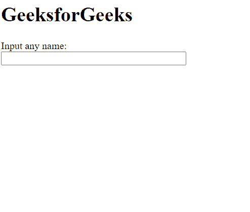

# script.aculo.us 自动完成器。本地选择选项

> 原文:[https://www . geesforgeks . org/script-aculo-us-autocompleter-local-choices-option/](https://www.geeksforgeeks.org/script-aculo-us-autocompleter-local-choices-option/)

script.aculo.us 库是一个跨浏览器库，旨在改进网站的用户界面。自动完成器可用于为网页中的文本字段提供自动完成支持。当自动完成选项作为自动完成方法的数组提供给选项显示时，使用本地自动完成器。

**自动完成器。本地选择** 选项用于定义提供给用户的自动完成选择的数量。

**语法:**

```
{ choices: number }

```

**值:**

*   **数字:**该选项采用一个数字，表示要提供的选择数量。默认值为 10。

**例 1:** 在本例中，我们将选项数量设置为 5，因此提供了 5 个选项。

## 超文本标记语言

```
<!DOCTYPE html>
<html>

<head>
    <!-- Include the required scripts -->
    <script type="text/javascript" 
        src="prototype.js">
    </script>

    <script type="text/javascript" 
src="scriptaculous.js?load = effects,controls">
    </script>
</head>

<body>
    <h1>GeeksforGeeks</h1>

    <label for="GeeksforGeeks">
        Input any name:
    </label>

    <br />
    <input id="GeeksforGeeks" autocomplete="off" 
        size="40" type="text" value="" />

    <div class="autocomplete" id="names" 
        style="display:none">
    </div>

    <script type="text/javascript">

        // Array to be used as choices
        var names = [
            'Ab',
            'Abc',
            'Abcd',
            'Abcde',
            'Abcdef',
            'Abcdefg'
        ];

        // Initialize the Autocompleter
        new Autocompleter.Local('GeeksforGeeks',
            'names', names, {

            // Specify the number of choices
            // to be displayed
            choices: 5
        });
    </script>
</body>

</html>
```

**输出:**



**例 2:** 在本例中，我们将选项数设置为 7，因此提供了 7 个选项。

## 超文本标记语言

```
<!DOCTYPE html>
<html>

<head>
    <!-- Include the required scripts -->
    <script type="text/javascript" 
        src="prototype.js">
    </script>

    <script type="text/javascript" 
src="scriptaculous.js?load = effects,controls">
    </script>
</head>

<body>
    <h1>GeeksforGeeks</h1>

    <label for="GeeksforGeeks">
        Input any name:
    </label>

    <br />
    <input id="GeeksforGeeks" autocomplete="off"
        size="40" type="text" value="" />

    <div class="autocomplete" id="names" 
        style="display:none">
    </div>

    <script type="text/javascript">

        // Array to be used as choices
        var names = [
            'Ab',
            'Abc',
            'Abcd',
            'Abcde',
            'Abcdef',
            'Abcdefg'
        ];

        // Initialize the Autocompleter
        new Autocompleter.Local('GeeksforGeeks',
            'names', names, {

            // Specify the number of choices
            // to be displayed
            choices: 7
        });
    </script>
</body>

</html>
```

**输出:**

