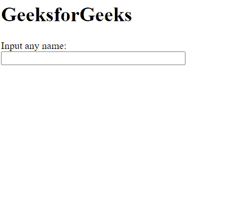

# script.aculo.us 自动完成器。本地部分搜索选项

> 原文:[https://www . geesforgeks . org/script-aculo-us-autocompleter-local-partial search-option/](https://www.geeksforgeeks.org/script-aculo-us-autocompleter-local-partialsearch-option/)

script.aculo.us 库是一个跨浏览器库，旨在改善网站的用户界面。自动完成器可用于为网页中的文本字段提供自动完成支持。当自动完成选项作为自动完成方法的数组提供给选项显示时，使用本地自动完成器。

**自动完成器。本地部分搜索** 选项用于设置自动完成器是否仅在给定数组中的字符串开头匹配输入的文本。值**为真**意味着它将只匹配数组字符串中任何单词开头的文本，而值**为假**将匹配单词任何位置的文本。

**语法:**

```
{ partialSearch: boolean }

```

**值:**

*   **布尔值:**这是一个布尔值，指定文本是否只在字符串的开头匹配。默认值为假。

**示例 1:** 在本例中，我们将 partialSearch 选项设置为 false，因此它将仅从字符串的开头开始搜索。

## 超文本标记语言

```
<!DOCTYPE html>
<html>

<head>
    <!-- Include the required scripts -->
    <script type="text/javascript" 
        src="prototype.js">
    </script>

    <script type="text/javascript" 
src="scriptaculous.js?load = effects,controls">
    </script>
</head>

<body>
    <h1>GeeksforGeeks</h1>

    <label for="GeeksforGeeks">
        Input any name:
    </label>

    <br />
    <input id="GeeksforGeeks" autocomplete="off"
        size="40" type="text" value="" />

    <div class="autocomplete" id="names"
        style="display:none">
    </div>

    <script type="text/javascript">

        // Array to be used as choices
        var names = [
            'Ab gfg',
            'Abc gfg',
            'Abcd gfg',
            'Abcde gfg',
            'Abcdef gfg',
            'Abcdefg gfg',
            'Abcdefgh gfg'
        ];

        // Initialize the Autocompleter
        new Autocompleter.Local('GeeksforGeeks',
            'names', names, {

            // Specify whether only the 
            // beginning of the strings
            // would be searched
            partialSearch: false
        });
    </script>
</body>

</html>
```

**输出:**



**示例 2:** 在本例中，我们将 partialSearch 选项设置为 true，因此它将从字符串中的任何位置进行搜索。

## 超文本标记语言

```
<!DOCTYPE html>
<html>

<head>
    <!-- Include the required scripts -->
    <script type="text/javascript" 
        src="prototype.js">
    </script>

    <script type="text/javascript" 
src="scriptaculous.js?load = effects,controls">
    </script>
</head>

<body>
    <h1>GeeksforGeeks</h1>

    <label for="GeeksforGeeks">
        Input any name:
    </label>

    <br />
    <input id="GeeksforGeeks" autocomplete="off"
        size="40" type="text" value="" />

    <div class="autocomplete" id="names"
        style="display:none">
    </div>

    <script type="text/javascript">

        // Array to be used as choices
        var names = [
            'Ab gfg',
            'Abc gfg',
            'Abcd gfg',
            'Abcde gfg',
            'Abcdef gfg',
            'Abcdefg gfg',
            'Abcdefgh gfg'
        ];

        // Initialize the Autocompleter
        new Autocompleter.Local('GeeksforGeeks',
            'names', names, {

            // Specify whether only the beginning
            // of the strings would be searched
            partialSearch: true
        });
    </script>
</body>

</html>
```

**输出:**

