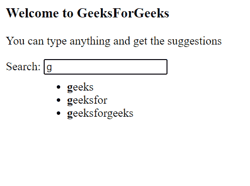

# 脚本自动完成令牌选项

> 原文:[https://www . geesforgeks . org/script-aculo-us-autocompleter-token-option/](https://www.geeksforgeeks.org/script-aculo-us-autocompleter-tokens-option/)

在本文中，我们将通过使用名为 **script.aculo.us** 的 JavaScript 库来展示**自动完成令牌**的效果，它有助于根据给定的建议以数组的形式自动完成文本字段。我们也可以添加一个建议列表。

请参考 [**script.aculo.us**](https://www.geeksforgeeks.org/script-aculo-us-introduction/) 下载库或预编译文件进行实现。此外，注意正确的文件路径，否则代码将无法工作。

**语法:**

```
new Autocompleter.Local(field, container, dataSource [ , options ] );
```

**参数:**

*   **字段:**文本字段的元素名称。
*   **容器:**给出建议的容器元素名称。
*   **数据源:**数据源可以是单个文本或字符串数组。

**演示:**在本例中，我们已经在 HTML 代码中使用了该函数。我们已经编写了一个小的 JavaScript 函数，当窗口加载并使用这个库的**自动完成令牌**方法时运行。通过在搜索框中键入任何内容，我们可以获得建议。

要查看效果，首先安装库，然后在本地环境中打开此程序。

## 超文本标记语言

```
<!DOCTYPE html>
<html>

<head>
    <script type="text/javascript" 
        src="prototype.js">
    </script>

    <script type="text/javascript" 
        src="scriptaculous.js?load = effects">
    </script>

    <script type="text/javascript">
        window.onload = function () {
            new Autocompleter.Local(
                'autoCompleteTextField',
                'autoCompleteList',
                ['abcxyz', 'bcdmnop', 'geeks', 
                'geeksfor', 'geeksforgeeks'],
                { ignoreCase: false }
            );
        }
    </script>
</head>

<body>
    <h3>Welcome to GeeksForGeeks</h3>

    <p>
        You can type anything and 
        get the suggestions
    </p>

    <div>
        <label>Search:</label>
        <input type="text" id="autoCompleteTextField" />
        <div id="autoCompleteList"></div>
    </div>
</body>

</html>
```

**输出:**

