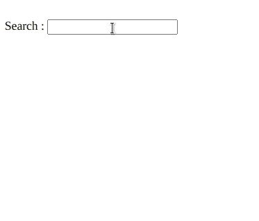
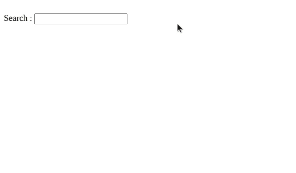

# 剧本。aculo.us 自动补编

> 原文:[https://www . geesforgeks . org/script-aculo-us-autocompleter/](https://www.geeksforgeeks.org/script-aculo-us-autocompleter/)

**自动完成模块**允许本地和服务器支持的自动完成文本输入字段。在本文中，我们将通过使用名为 **script.aculo.us** 的 JavaScript 库来展示 **自动完成器** 的效果，它有助于根据给定的建议以数组的形式自动完成文本字段。我们也可以添加一个建议列表。

**创建 Ajax 自动完成器:**

**语法:**

```
new Ajax.Autocompleter(element, container, url {options } )
```

**自动完成选项:**

<figure class="table">

| 

#### Select

 | 

#### Description

 |
| **参数名称** | 它可以用来给出包含服务器端发布的文本字段内容的参数的名称。 |
| **minchars** | 它可以用来指定服务器端建议可见的字符数。 |
| **频率** | 它可以用来指定内部检查之间的时间间隔，以验证是否应该将请求发送到服务器端。 |
| **指示器** | 它可用于在处理服务器请求时显示 id 或对元素的引用。 |
| **参数** | 它可以用来向服务器端资源传递额外的参数。 |
| **更新元素** | 这是一个回调函数，当用户选择其中一个建议时触发。然后，它用所选建议更新文本字段值。 |
| **后期要素** | 它是一个回调函数，在执行完 updateElement 函数后被触发。 |
| **代币** | 它可以用来表示允许在文本字段中输入多个元素的标记，并且每个元素都可以单独自动完成。令牌可以由单个字符串或字符串数组组成。 |

</figure>

**示例:**

## 超文本标记语言

```
<!DOCTYPE html>
<html>

<head>
    <title></title>

    <script type="text/javascript" 
        src="./javascript/prototype.js">
    </script>

    <script type="text/javascript" src=
"./javascript/scriptaculous.js?load = effects,controls">
    </script>

    <script type="text/javascript">
        window.onload = function () {
            new Ajax.Autocompleter("searchBox", 
                "Result", "Suggestions.php");
        };
    </script>
</head>

<body>
    <div>
        <label>Search :</label>
        <input type="text" id="searchBox" />
        <div id="Result"></div>
    </div>
</body>

</html>
```

Ajax 自动完成器中的建议存储在服务器上，您可以使用 PHP、ruby、python、node 或任何其他语言来设计您的服务器。这里我们也使用了 PHP。

在建议中，PHP 文件我们使用了一个简单的 HTML 无序列表作为建议

```
<ul>
   <li>effect</li>
   <li>autocomplete</li>
   <li>ajax</li>
   <li>php</li>
   <li>paramname</li>
   <li>suggestions</li>
</ul>
```

### 输出



**创建本地自动完成器:**

**语法:**

```
new Autocompleter.Local(field, container, dataSource {options});
```

**自动完成器选项:**

<figure class="table">

| 

#### option

 | 

#### Description

 |
| **option** | It can be used to specify the number of options to display. |
| **部分搜索** | It can be used to match words at the beginning of a complete string in the database. |
| **全搜索** | It can be used to enable matching anywhere within the completion string. |
| 党徒 | Can be used to define the number of characters that must be typed before triggering partial matching. |
| **忽略案例** | Can be used to ignore the case of characters when matching. |

</figure>

**示例:**

## 超文本标记语言

```
<!DOCTYPE html>
<html>

<head>
    <script type="text/javascript" 
        src="./javascript/prototype.js">
    </script>

    <script type="text/javascript" src=
"./javascript/scriptaculous.js?load = effects,controls">
    </script>

    <script type="text/javascript">
        window.onload = function () {
            new Autocompleter.Local(
                'searchBox',
                'Result',
                ['effect', 'drag', 'drop', 'auto', 
                    'complete', 'slider', 'sound'],
            );
        }
    </script>
</head>

<body>
    <div>
        <label>Search :</label>
        <input type="text" id="searchBox" />
        <div id="Result"></div>
    </div>
</body>

</html>
```

### 输出

