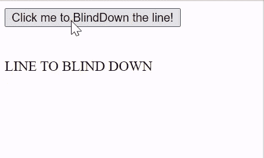
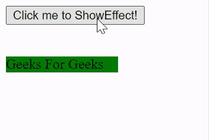

# script.aculo.us BlindDown 效果

> 原文:[https://www . geeksforgeeks . org/script-aculo-us-blind down-effect/](https://www.geeksforgeeks.org/script-aculo-us-blinddown-effect/)

在本文中，我们将通过使用名为 **script.aculo.us** 的 JavaScript 库来演示**盲降**的效果。盲降效果为元素提供了平滑的盲降过渡。我们也可以调整这个效果的持续时间。

**语法:**

```
Effect.BlindDown('id_of_element');
```

//或

```
Effect.BlindDown('id_of_element', [options]);
```

**选项:**

*   **持续时间:**淡化元素所用的持续时间，默认为 1.0。
*   **scaleX:** 布尔值，默认为假。
*   **scaleY:** 布尔值，默认为真。
*   **scaleContent:** 布尔值，默认为真。
*   **scaleFromCenter:** 布尔值，默认为  false。
*   **缩放自:**整数值默认为 100。
*   **缩放模式:**用字符串值设置缩放模式，默认为‘框’。
*   **scaleTo:** 整数值默认为 100。

**注意:**要使用这个库，我们应该安装这个库，然后在我们的程序中使用它。要做到这一点，你可以跟随链接[http://script.aculo.us/downloads](http://script.aculo.us/downloads)。

**示例 1:** 为了演示这种效果的使用，我们编写了一小段代码。其中我们编写了一个名为 **ShowEffect** 方法的小 JavaScript 函数，使用了这个库的 **BlindDown** 方法。点击**点击我就可以屏蔽这条线！**，你会看清楚效果的。

若要查看效果，请先安装库，然后在本地环境中打开此程序。

## 超文本标记语言

```
<!DOCTYPE html>
<html>

<head>
    <script type="text/javascript" 
        src="prototype.js">
    </script>

    <script type="text/javascript" 
        src="scriptaculous.js?load = effects,controls">
    </script>

    <script type="text/javascript">
        function ShowEffect(element) {
            new Effect.BlindDown(element, 
            { duration: 1, from: 0, to: 1.0 });
        }
    </script>
</head>

<body>
    <div onclick="ShowEffect('geeks_1')">
        <button type="button">
            Click me to BlindDown the line!
        </button>
    </div>
    <br><br>

    <div id="geeks_1">
        LINE TO BLIND DOWN
    </div>
</body>

</html>
```

**输出:**



**例 2:**

## 超文本标记语言

```
<!DOCTYPE html>
<html>

<head>
    <script type="text/javascript" 
        src="prototype.js">
    </script>

    <script type="text/javascript" 
        src="scriptaculous.js?load = effects,controls">
    </script>

    <script type="text/javascript">
        function ShowEffect(element) {
            new Effect.BlindDown(element, 
            { duration: 1, from: 0, to: 1.0 });
        }
    </script>
</head>

<body>
    <div onclick="ShowEffect('geeks_1')">
        <button type="button">
            Click me to ShowEffect!
        </button>
    </div>
    <br><br>

    <div id="geeks_1">
        <div style="width: 10%; height: 10%; 
            background-color: green;">
            Geeks For Geeks
        </div>
    </div>
</body>

</html>
```

**输出:**

