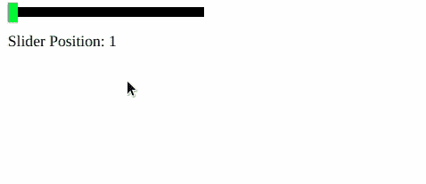

# 脚本 aculo.us 创建滑块

> 原文:[https://www . geesforgeks . org/script-aculo-us-create-sliders/](https://www.geeksforgeeks.org/script-aculo-us-create-sliders/)

滑块是一种小轨道，您可以沿着它滑动手柄。它转化为一个数值。使用 script.aculo.us 的滑块模块，您可以创建具有大量控制的滑块。

**语法:**

```
new Control.Slider( handle, track, {options} );
```

**滑块选项:**

<figure class="table">

| **选项**

 | **说明** |
| 轴 | Can be used to set the axis of the slider, that is, horizontal or vertical. The default is horizontal. |
| 范围 | Can be used to set the range of the slider. |
| 滑块值 | Can be used to set the initial position of the slider. The default position is the initial value of the range. |
| 值 | It can be used to set the discrete values that the slider can take within its range. |
| 禁用 | Can be used to create slides that are initially disabled. |
| 设置值 | Can be used to set the value and position of the slider. |
| 设置禁用

 | Can be used to disable a slider. |
| 设置启用 | Can be used to enable sliders. |

</figure>

**回调选项:**

<figure class="table">

| **选项** | **描述** |
| T21 】 【 on slide 】 will be triggered whenever the slider is dragged. | . This function takes the slider value as its parameter. |
| onChange | Triggered whenever the slider value changes. This function takes the slider value as its parameter. |

</figure>

**示例:**

## 超文本标记语言

```
<!DOCTYPE html> 
<html> 

<head> 
    <script type="text/javascript"
        src="prototype.js"> 
    </script> 

    <script type="text/javascript"
        src="scriptaculous.js?load = slider"> 
    </script> 

    <script> 
        window.onload = function () { 
            new Control.Slider('handle', 'track', { 
                range: $R(1, 100), 
                values: [1, 10, 20, 30, 40, 
                    50, 60, 70, 80, 90, 100], 
                sliderValue: 1, 
                onSlide: function (value) { 
                    $('sliderValue').innerHTML 
                        = 'Slider Position: ' + value; 
                } 
            }); 
        } 
    </script> 

    <style> 
        .track { 
            background-color: rgb(0, 0, 0); 
            position: relative; 
            height: 10px; 
            width: 200px; 
            cursor: pointer; 
        } 

        .handle { 
            background-color: #13e421; 
            height: 20px; 
            width: 4.25px; 
            top: -4.25px; 
            cursor: move; 
        } 
    </style> 
</head> 

<body> 
    <div id="track" class="track "> 
        <div id="handle" class="handle"
            style="width: 10px;"> 
        </div> 
    </div> 

    <p id="sliderValue"></p>

</body> 

</html>
```

**输出:**

