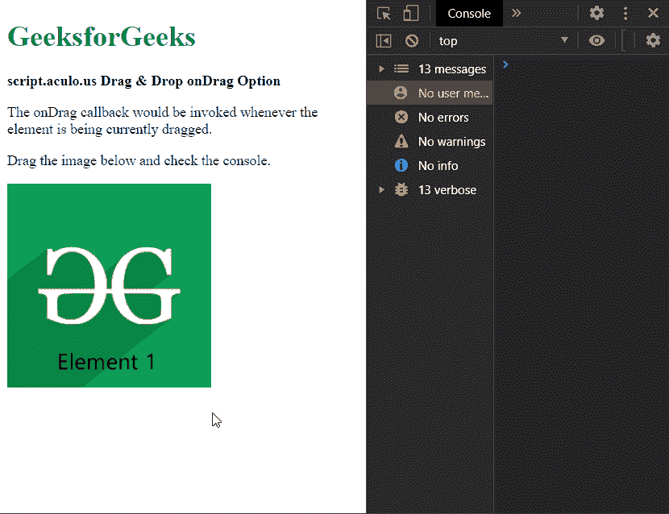

# 脚本. aculo.us 拖动&拖放更改选项

> 原文:[https://www . geesforgeks . org/script-aculo-us-拖放-更改-option/](https://www.geeksforgeeks.org/script-aculo-us-drag-drop-change-option/)

script.aculo.us 库是一个跨浏览器库，旨在改进网站的用户界面。拖放模块可用于将任何元素拖放到拖放区。

change 选项就像 onDrag 选项一样被调用，也就是说，它被用来指定一个回调函数，只要元素当前被拖动，这个回调函数就会被调用。但是与变更选项相比，onDrag 选项是更受欢迎的选项。

**语法:**

```
new Draggable('element', {change: 'function'});
```

**参数:**该选项具有如上所述的单一值，如下所述:

*   **函数:**这是一个回调函数，每当拖动元素时都会调用。

以下示例说明了该选项的使用。

**示例:**

## 超文本标记语言

```
<!DOCTYPE html> 
<html> 
<head> 
  <script type="text/javascript" 
    src="javascript/prototype.js"> 
  </script> 
  <script type="text/javascript"
    src="javascript/scriptaculous.js"> 
  </script> 

  <script type="text/javascript"> 
    window.onload = function () { 

      // Define a function to be used 
      // when the element is being dragged 
      new Draggable('elem1', { 
        change: (elem) => { 
          console.log("The element is " 
            + "currently being dragged"); 

          // The element that is being dragged 
          // can be accessed using the parameter 
          // in the callback function 
        }, 

        onEnd: () => { 
          console.log("The dragging of " 
            + "the element has stopped"); 
        } 
      }); 
    }; 
  </script> 
</head> 
<body> 
  <div> 
    <h1 style="color: green"> 
      GeeksforGeeks 
    </h1> 
  </div> 
  <strong> 
    script.aculo.us Drag & 
    Drop change Option 
  </strong> 

<p> 
    The change callback would be invoked 
    whenever the element is being currently 
    dragged. 
  </p>

<p> 
    Drag the image below and check 
    the console. 
  </p>

   
</body> 
</html>
```

**输出:**

