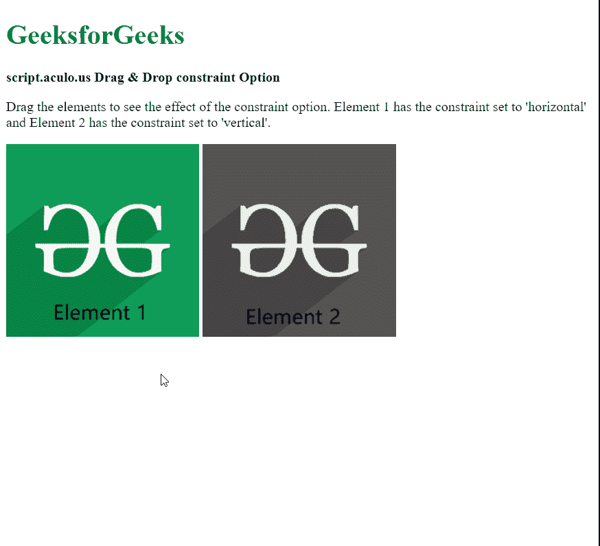

# 拖动&拖动约束选项

> 原文:[https://www . geesforgeks . org/script-aculo-us-拖放-约束-option/](https://www.geeksforgeeks.org/script-aculo-us-drag-drop-constraint-option/)

script.aculo.us 库是一个跨浏览器库，旨在改进网站的用户界面。拖放模块可用于将任何元素拖放到拖放区。

**约束**选项用于在拖动可拖动项目时限制其移动方向。它可以设置为“水平”或“垂直”，从而只允许在该方向上移动。

**语法:**

```
{ constraint: value }
```

**参数:**该选项具有如上所述的单一值，如下所述:

*   **值:**这是指定约束方向的字符串值。它可以是“水平”或“垂直”。默认值设置为 null。

以下示例说明了该选项的使用。

**示例:**

## 超文本标记语言

```
<!DOCTYPE html>
<html>

<head>
  <script type="text/javascript" 
          src="prototype.js">
  </script>

  <script type="text/javascript"
          src="scriptaculous.js">
  </script>

  <script type="text/javascript">
    window.onload = function () {

      // Draggable element with 
      // constraint set to 'horizontal'
      new Draggable('elem1', 
                    { constraint: 'horizontal' });

      // Draggable element with 
      // constraint set to 'vertical'
      new Draggable('elem2',
                    { constraint: 'vertical' });
    };
  </script>
</head>

<body>
  <div>
    <h1 style="color: green">
      GeeksforGeeks
    </h1>
  </div>

  <strong>
    script.aculo.us Drag &
    Drop constraint Option
  </strong>

  <p>
    Drag the elements to see the
    effect of the constraint option. 
    Element 1 has the constraint set 
    to 'horizontal' and Element 2 has
    the constraint set to 'vertical'.
  </p>

  
  
</body>

</html>
```

**输出:**

