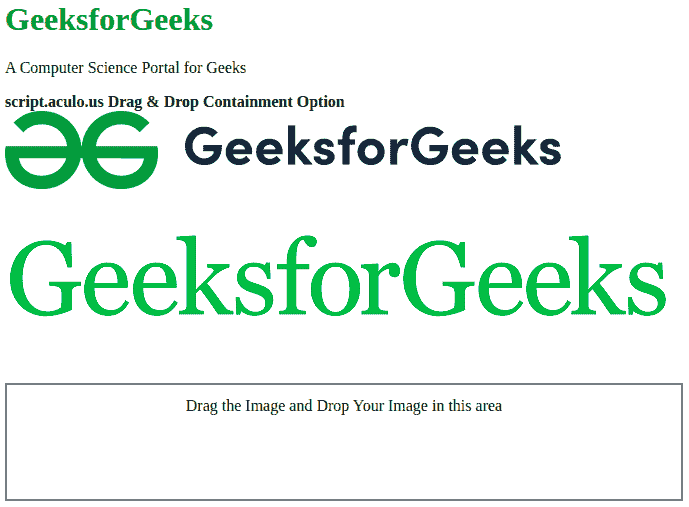

# 脚本. aculo.us 拖动&放置遏制选项

> 原文:[https://www . geesforgeks . org/script-aculo-us-拖放-遏制-option/](https://www.geeksforgeeks.org/script-aculo-us-drag-drop-containment-option/)

这个**脚本用于创建一个元素数组。它必须是父级的，并且拖放区只接受这些，您可以将一个可拖动的元素拖动到拖放区。如果包含与可拖动元素的父元素的 id 相同，则该元素将被放置在拖放区。**

**语法:**

```
Droppables.add('element', 
    {containment: element ID or array of parent's IDs}
);

```

**值:**

*   **标识:**该选项采用元素标识或父标识数组。

**示例:**在此示例中，第二个图像被放置区域接受，其原因是第二个图像的 Containment 的父代为‘gfg’。该父代的每个子代都将被拖放区接受。

## 超文本标记语言

```
<!DOCTYPE html>
<html>

<head>
    <script type="text/javascript" 
        src="prototype.js">
    </script>

    <script type="text/javascript" 
        src="scriptaculous.js">
    </script>

    <script type="text/javascript">
        window.onload = function () {
            $A($('draggables').getElementsByTagName('img'))
                .each(function (item) {
                    new Draggable(item, { 
                        revert: true, 
                        ghosting: true 
                    });
                });

            $A($('gfg').getElementsByTagName('img'))
                .each(function (item) {
                    new Draggable(item, { 
                        revert: true, 
                        ghosting: true 
                    });
                });

            Droppables.add('droparea', {
                 hoverclass: 'hoverActive', 
                 containment: 'gfg', 
                 onDrop: moveItem 
            });

            // Set drop area default non cleared.
            $('droparea').cleared = false;
        }

        function moveItem(draggable, droparea) {
            if (!droparea.cleared) {
                droparea.innerHTML = '';
                droparea.cleared = true;
            }

            draggable.parentNode.removeChild(draggable);
            droparea.appendChild(draggable);
        }
    </script>

    <style type="text/css">
        #draggables {
            width: 550px;
            height: 73px;
        }

        #gfg {
            width: 550px;
            height: 73px;
        }

        #droparea {
            float: left;
            width: 650px;
            height: 90px;
            border: 2px solid gray;
            text-align: center;
            font-size: 16px;
            padding: 12px;
        }
    </style>
</head>

<body>
    <div>
        <h1 style="color: green">
            GeeksforGeeks
        </h1>

        <p>A Computer Science Portal for Geeks</p>
    </div>

    <strong>
        script.aculo.us Drag & Drop 
        Containment Option
    </strong>

    <div id="draggables">
        
    </div>
    <br><br>

    <div id="gfg">
        
    </div>

    <br><br><br><br><br>
    <div id="droparea">
        Drag the Image and Drop Your 
        Image in this area
    </div>
</body>

</html>
```

**输出:**

*   **拖放前:**



*   **拖放后:**

