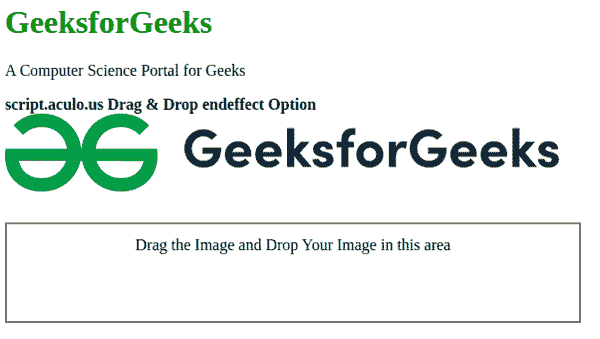

# 拖动&放下 endeffect 选项

> 原文:[https://www . geesforgeks . org/script-aculo-us-拖放-endeffect-option/](https://www.geeksforgeeks.org/script-aculo-us-drag-drop-endeffect-option/)

这个脚本用来定义当一个合适的可拖动元素停止拖动时调用的函数。该函数可用于定义任何效果。

**语法:**

```
{ endeffect: effectFunction }

```

**值:**

*   **效果函数:**该值定义了包含当拖动山墙停止拖动时要显示的效果的函数。

以下示例说明了**拖动&放下 endeffect** 选项:

**示例:**

## 超文本标记语言

```
<!DOCTYPE html>
<html>

<head>
    <script type="text/javascript" 
        src="prototype.js">
    </script>

    <script type="text/javascript" 
        src="scriptaculous.js">
    </script>

    <script type="text/javascript">
        window.onload = function () {

            $A($('draggables').getElementsByTagName('img'))
                .each(function (item) {
                    new Draggable(item, {
                        revert: true, ghosting: true,

                        // Define the effect to be used when 
                        // the draggable is stopped dragging
                        endeffect: function (element) {
                            new Effect.Opacity(element, {
                                from: 0,
                                to: 1.0,
                                duration: 5
                            })
                        }
                    });
                });

            Droppables.add('droparea',
                { onDrop: moveItem }
            );

            // Set drop area default non cleared.
            $('droparea').cleared = false;
        }

        function moveItem(draggable, droparea) {
            if (!droparea.cleared) {
                droparea.innerHTML = '';
                droparea.cleared = true;
            }

            draggable.parentNode.removeChild(draggable);
            droparea.appendChild(draggable);
        }
    </script>
    <style type="text/css">
        #draggables {
            width: 550px;
            height: 73px;
        }

        #droparea {
            float: left;
            width: 550px;
            height: 73px;
            border: 2px solid gray;
            text-align: center;
            font-size: 16px;
            padding: 12px;
        }
    </style>
</head>

<body>
    <div>
        <h1 style="color: green">
            GeeksforGeeks
        </h1>

        <p>A Computer Science Portal for Geeks</p>

    </div>
    <strong>
        script.aculo.us Drag & Drop
        endeffect Option
    </strong>
    <div id="draggables">
        
    </div>
    <br>
    <br>
    <div id="droparea">
        Drag the Image and Drop Your Image
        in this area
    </div>
</body>

</html>
```

**输出:**

