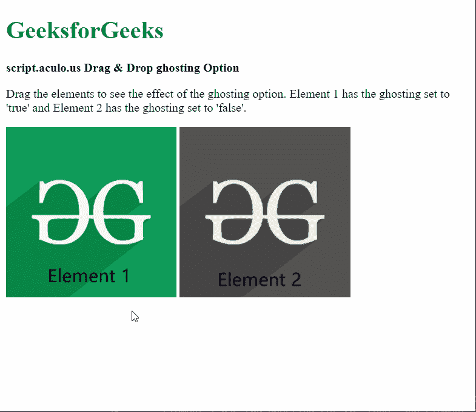

# 拖动&放下重影选项

> 原文:[https://www . geesforgeks . org/script-aculo-us-拖放-重影-option/](https://www.geeksforgeeks.org/script-aculo-us-drag-drop-ghosting-option/)

script.aculo.us 库是一个跨浏览器库，旨在改进网站的用户界面。拖放模块可用于将任何元素拖放到拖放区。

**重影**选项用于指定是否创建了元素的克隆，并且移动该克隆而不是原始元素，直到其被删除。其默认值为“false”，这意味着不会将任何克隆设为默认值。

**语法:**

```
{ ghosting: value }
```

**参数:**该选项具有如上所述的单一值，如下所述:

*   **值:**这是一个布尔值，指定拖动时是否会创建克隆。默认值为“假”。

以下示例说明了该选项的使用。

**示例:**

## 超文本标记语言

```
<!DOCTYPE html>
<html>

<head>
  <script type="text/javascript"
          src="prototype.js">
  </script>

  <script type="text/javascript" 
          src="scriptaculous.js">
  </script>

  <script type="text/javascript">
    window.onload = function () {

      // Draggable element with
      // ghosting set to true
      new Draggable('elem1', 
          { ghosting: true });

      // Draggable element with
      // ghosting set to false
      new Draggable('elem2', 
          { ghosting: false });
    };
  </script>
</head>

<body>
  <div>
    <h1 style="color: green">
      GeeksforGeeks
    </h1>
  </div>

  <strong>
    script.aculo.us Drag &
    Drop ghosting Option
  </strong>

  <p>
    Drag the elements to see the 
    effect of the ghosting option.
    Element 1 has the ghosting set 
    to 'true' and Element 2 has the 
    ghosting set to 'false'.
  </p>

  
  
</body>

</html>
```

**输出:**

