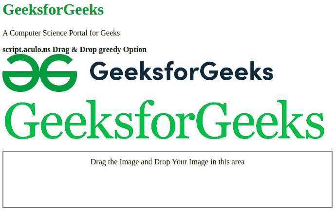

# 拖动&放下贪婪的选项

> 原文:[https://www . geesforgeks . org/script-aculo-us-拖放-greedy-option/](https://www.geeksforgeeks.org/script-aculo-us-drag-drop-greedy-option/)

这个脚本. aculo.us 拖放贪婪选项是用来停止处理悬停其他可拖放的，在拖拽下不会被搜索到。这个选项的默认值是 true，这意味着拖放区将接受可拖动元素，而 false 则不会。

**语法:**

```
Droppables.add('element', {greedy: false or true});
```

**示例:**

```
<!DOCTYPE html>
<html>

<head>
    <script type="text/javascript" 
        src="scriptaculous-js-1.9.0/lib/prototype.js">
    </script>

    <script type="text/javascript" 
        src="scriptaculous-js-1.9.0/src/scriptaculous.js">
    </script>

    <script type="text/javascript">
        window.onload = function () {

            $A($('draggables').getElementsByTagName(
                'img')).each(function (item) {
                    new Draggable(
                        item, { revert: true, ghosting: true });
                });

            Droppables.add(
                'droparea', {
                    hoverclass: 'hoverActive',
                greedy: false, onDrop: moveItem
            });

            // Set drop area default non cleared.
            $('droparea').cleared = false;
        }

        function moveItem(draggable, droparea) {
            if (!droparea.cleared) {
                droparea.innerHTML = '';
                droparea.cleared = true;
            }

            draggable.parentNode.removeChild(draggable);
            droparea.appendChild(draggable);
        }
    </script>

    <style type="text/css">
        #draggables {
            width: 550px;
            height: 73px;
        }

        #gfg {
            width: 550px;
            height: 73px;
        }

        #droparea {
            float: left;
            width: 650px;
            height: 90px;
            border: 2px solid gray;
            text-align: center;
            font-size: 16px;
            padding: 12px;
        }
    </style>
</head>

<body>
    <div>
        <h1 style="color: green">
            GeeksforGeeks
        </h1>

        <p>A Computer Science Portal for Geeks</p>
    </div>

    <strong>
        script.aculo.us Drag & Drop
        greedy Option
    </strong>

    <div id="draggables">
        
        
    </div>

    <div id="droparea">
        Drag the Image and Drop Your 
        Image in this area
    </div>
</body>

</html>
```

**输出:**

*   **拖放前:**
    
*   **拖放后:**拖放区不会接受元素。
    T3】