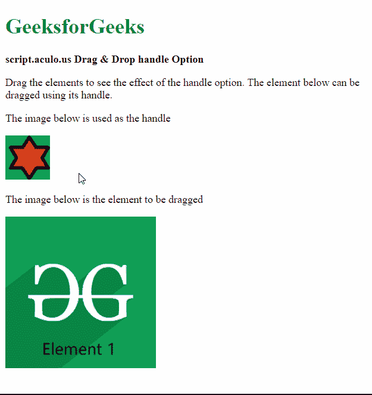

# 脚本. aculo.us 拖动&放下手柄选项

> 原文:[https://www . geesforgeks . org/script-aculo-us-拖放-手柄-option/](https://www.geeksforgeeks.org/script-aculo-us-drag-drop-handle-option/)

script.aculo.us 库是一个跨浏览器库，旨在改进网站的用户界面。拖放模块可用于将任何元素拖放到拖放区。

**手柄**选项用于指定移动可拖动项目时用作手柄的元素。它可以是对 DOM 元素的引用，也可以是定义要使用的句柄的字符串。

**语法:**

```
{ handle: value }
```

**参数:**该选项具有如上所述的单一值，如下所述:

*   **值:**这是对指定句柄的 DOM 元素或字符串值的引用。未设置默认值。

以下示例说明了该选项的使用。

**示例:**

## 超文本标记语言

```
<!DOCTYPE html>
<html>
<head>
  <script type="text/javascript"
          src="prototype.js">
  </script>

  <script type="text/javascript"
          src="scriptaculous.js">
  </script>

  <script type="text/javascript">
    window.onload = function () {

      // Draggable element with the
      // handle defined
      new Draggable('elem1', 
          { handle: 'handle_img' });
    };
  </script>
</head>

<body>
  <div>
    <h1 style="color: green">
      GeeksforGeeks
    </h1>
  </div>

  <strong>
    script.aculo.us Drag &
    Drop handle Option
  </strong>

  <p>
    Drag the elements to see the
    effect of the handle option.
    The element below can be dragged
    using its handle.
  </p>

  <p>
    The image below is used 
    as the handle
  </p>

  <!-- Define the image of the handle -->
  

  <p>
    The image below is the 
    element to be dragged
  </p>

  <!-- Define the image to be dragged -->
  
</body>

</html>
```

**输出:**

