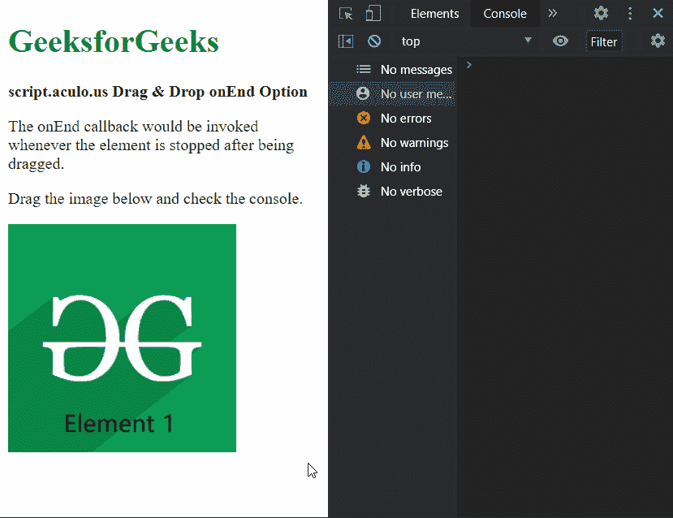
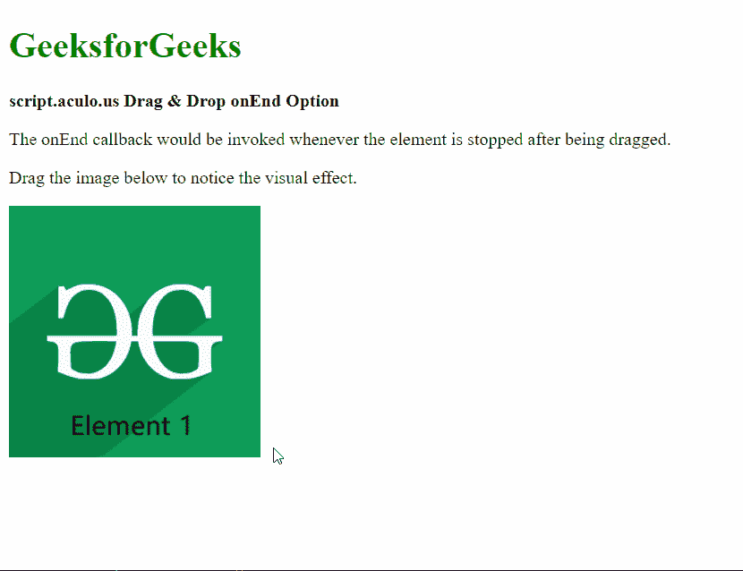

# 拖动&放下一个选项

> 原文:[https://www . geesforgeks . org/script-aculo-us-拖放-onend-option/](https://www.geeksforgeeks.org/script-aculo-us-drag-drop-onend-option/)

script.aculo.us 库是一个跨浏览器库，旨在改进网站的用户界面。拖放模块可用于将任何元素拖放到拖放区。

**onEnd** 选项用于指定一个回调函数，该函数将在元素拖动结束时被调用。被拖动的元素将作为参数传递给函数。

**包括脚本:**

**第一步:**开始之前，您需要下载包含在我们的 HTML 页面的<头>标签中的脚本文件。你可以从[http://script.aculo.us/downloads](http://script.aculo.us/downloads)下载

**第二步:**解压文件，把需要的文件(主要是 *prototype.js* 和 *scriptaculous.js* )放到你文件夹的当前根目录下。

**第三步:**将你选择的任何图像放在你当前文件夹的根目录下，就像下面的例子中使用的*elem1.png 一样。*

**语法:**

```
{ onEnd: function }
```

**参数:**该选项具有如上所述的单一值，如下所述:

*   **函数:**这是一个回调函数，每当拖动元素结束时都会调用。

以下示例说明了该选项的使用。

**例 1:**

## 超文本标记语言

```
<!DOCTYPE html>
<html>
<head>
  <script type="text/javascript" 
    src="prototype.js">
  </script>
  <script type="text/javascript" 
    src="scriptaculous.js">
  </script>

  <script type="text/javascript">
    window.onload = function () {

      // Define a function to be used
      // when the element stops after
      // being dragged
      new Draggable('elem1', {
        onEnd: (elem) => {
          console.log(
            "The dragging of the element has stopped"
          );
          console.log(elem);
        }
      });
    };
  </script>
</head>

<body>
  <div>
    <h1 style="color: green">
      GeeksforGeeks
    </h1>
  </div>
  <strong>
    script.aculo.us Drag &
    Drop onEnd Option
  </strong>

  <p>
    The onEnd callback would be
    invoked whenever the element 
    is stopped after being dragged.
  </p>

  <p>
    Drag the image below and
    check the console.
  </p>

  
</body>
</html>
```

**输出:**



**例 2:**

## 超文本标记语言

```
<!DOCTYPE html>
<html>

<head>
  <script type="text/javascript" 
    src="prototype.js">
  </script>
  <script type="text/javascript" 
    src="scriptaculous.js">
  </script>

  <script type="text/javascript">
    window.onload = function () {
      new Draggable('elem1', {

        // Define a function to be used
        // when the element stops 
        // to be dragged
        onEnd: () => {
          new Effect.Squish('elem1',
          );
        }
      });
    };
  </script>
</head>
<body>
  <div>
    <h1 style="color: green">
      GeeksforGeeks
    </h1>
  </div>
  <strong>
    script.aculo.us Drag &
    Drop onEnd Option
  </strong>

  <p>
    The onEnd callback would be 
    invoked whenever the element is
    stopped after being dragged.
  </p>

  <p>
    Drag the image below to notice
    the visual effect.
  </p>

  
</body>

</html>
```

**输出:**



**参考:**T2】http://script.aculo.us/