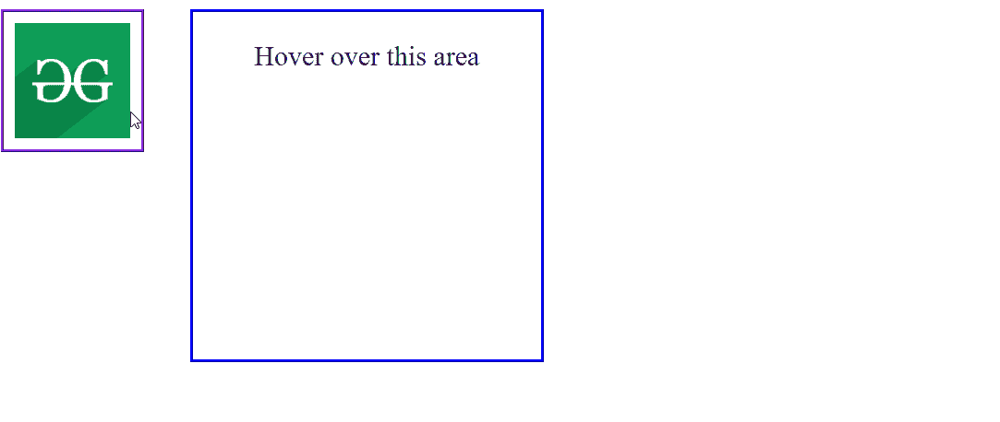

# 拖动&悬停选项

> 原文:[https://www . geesforgeks . org/script-aculo-us-拖放-on over-option/](https://www.geeksforgeeks.org/script-aculo-us-drag-drop-onhover-option/)

script.aculo.us 库是一个跨浏览器库，旨在改进网站的用户界面。拖放模块可用于将任何元素拖放到拖放区。

现有量选项用于指定当合适的可拖动项目悬停在悬停目标上时激活的回调函数。

**语法:**

```
{onHover: function}
```

**参数**:该选项具有如上所述的单一值，如下所述:

*   **函数**:这是一个回调函数，每当元素悬停在悬停目标上时都会调用。

以下示例说明了该选项的使用。

**示例:**

## 超文本标记语言

```
<!DOCTYPE html>
<html>

<head>
    <title>Drag and Drop onHover option</title>

    <script type="text/javascript" 
        src="/javascript/prototype.js">
    </script>

    <script type="text/javascript" 
        src="/javascript/scriptaculous.js">
    </script>

    <style>
        #draggables {
            border: 3px ridge blueviolet;
            float: left;
            padding: 9px;
        }

        #hoverarea {
            display: flex;
            flex-direction: column;
            float: left;
            margin-left: 40px;
            width: 300px;
            height: 300px;
            border: 3px ridge blue;
            text-align: center;
            font-size: 24px;
        }

        .container {
            position: relative;
            text-align: center;
            color: white;
        }

        #over {
            display: none;
        }

        .hoverActive {
            background-color: #8cdd81;
        }
    </style>

    <script type="text/javascript">

        window.onload = function () {
            // Make the image draggable

            $A($('draggables').getElementsByTagName(
                'img')).each(function (item) {
                new Draggable(item, { 
                    revert: true, ghosting: true 
                });
            });

            Droppables.add(
                'hoverarea', {
                hoverclass: 'hoverActive',
                onHover: moveItem
            });
        }

        // We want display a text when we are 
        // over the hover area
        function moveItem(draggable, hoverarea) {
            document.getElementById(
                "over").style.display = "block";
        }
    </script>
</head>

<body>

    <!-- Draggable image -->
    <div id="draggables">
        
    </div>

    <!-- Hover Area -->
    <div id="hoverarea">
        <p>Hover over this area</p>

        <div class="container">
            <div id="over">Over the hover area</div>
        </div>
    </div>
</body>

</html>
```

**输出:**

