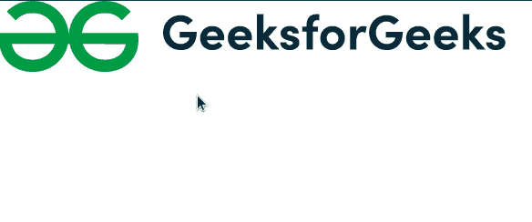

# 脚本. aculo.us 拖动&拖放恢复选项

> 原文:[https://www . geesforgeks . org/script-aculo-us-拖放-还原-option/](https://www.geeksforgeeks.org/script-aculo-us-drag-drop-revert-option/)

当拖动结束时，此脚本使用拖放恢复选项返回到其原始位置。它还指定拖动操作停止时是否调用 reverteffect 回调。

**语法:**

```
new Draggable('element', {revert:true});

```

**值:**

*   **回复:**这个值有真和假两个值，默认为假。

**示例:**

## 超文本标记语言

```
<!DOCTYPE html>
<html>

<head>
    <script type="text/javascript" src=
        "scriptaculous-js-1.9.0/lib/prototype.js">
    </script>

    <script type="text/javascript" src=
        "scriptaculous-js-1.9.0/src/scriptaculous.js">
    </script>

    <script type="text/javascript">
        window.onload = function () {
            $A($('draggables').getElementsByTagName('img'))
                .each(function (item) {
                    new Draggable(item, {
                        revert: true,
                        ghosting: true
                    });
                });

            Droppables.add('droparea', {
                hoverclass: 'hoverActive',
                onDrop: moveItem
            });

            // Set drop area default non cleared. 
            $('droparea').cleared = false;
        }

        function moveItem(draggable, droparea) {
            if (!droparea.cleared) {
                droparea.innerHTML = '';
                droparea.cleared = true;
            }

            draggable.parentNode.removeChild(draggable);
            droparea.appendChild(draggable);
        } 
    </script>

    <style type="text/css">
        #draggables {
            width: 550px;
            height: 73px;
        }

        #gfg {
            width: 550px;
            height: 73px;
        }
    </style>
</head>

<body>
    <div id="draggables">
        
    </div>
</body>

</html>
```

**输出:**

