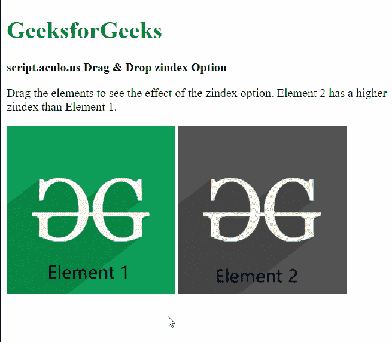

# 拖动&放下 zindex 选项

> 原文:[https://www . geesforgeks . org/script-aculo-us-拖放-zindex-option/](https://www.geeksforgeeks.org/script-aculo-us-drag-drop-zindex-option/)

script.aculo.us 库是一个跨浏览器库，旨在改进网站的用户界面。拖放模块可用于将任何元素拖放到拖放区。

**zindex** 选项用于指定被拖动元素的 CSS z 索引。z 索引用于指定页面上元素的顺序。较高的值意味着该元素将显示在具有较低值的元素之上。

**语法:**

```
{ zindex: value }
```

**参数:**该选项具有如上所述的单一值，如下所述:

*   **值:**这是一个整数值，用于指定可拖动元素的 z 索引。默认值为 1000。

以下示例说明了该选项的使用。

**示例:**

## 超文本标记语言

```
<!DOCTYPE html>
<html>
<head>
  <script type="text/javascript" 
          src="prototype.js">
  </script>

  <script type="text/javascript" 
          src="scriptaculous.js">
  </script>

  <script type="text/javascript">
    window.onload = function () {

      // Draggable element with z-index set to 100
      new Draggable('elem1', { zindex: 100 });

      // Draggable element with z-index set to 200
      new Draggable('elem2', { zindex: 200 });
    };
  </script>
</head>

<body>
  <div>
    <h1 style="color: green">
      GeeksforGeeks
    </h1>
  </div>

  <strong>
    script.aculo.us Drag &
    Drop zindex Option
  </strong>

  <p>
     Drag the elements to see the effect of 
     the zindex option. Element 2 has a 
     higher zindex than Element 1.
  </p>

  
  
</body>

</html>
```

**输出:**

