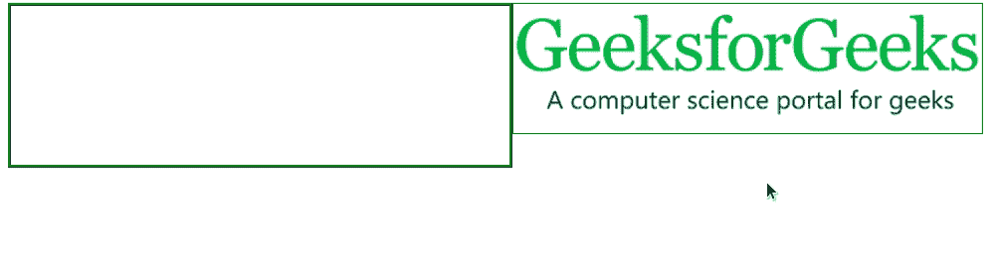

# 拖动&放下

> 原文:[https://www.geeksforgeeks.org/script-aculo-us-drag-drop/](https://www.geeksforgeeks.org/script-aculo-us-drag-drop/)

DragDrop 模块可用于使任何元素可拖动，或者将其放入拖放区。

**使一个元素可拖动:**可拖动元素可以通过创建一个可拖动实例，然后识别要被拖动的元素来实现

**语法:**

```
new Draggable( element_id, {options} );
```

**可拖动选项:**

<figure class="table">

| **选项** | **描述** |
| 归还 | 它用于指定元素在被拖动后是否应返回其原始位置。 |
| 突然的 | 它用于使可拖动元素约束其移动。 |
| 锌德克斯 | 它用于在 CSS 样式表中指定 z 索引。 |
| 重像 | 它用于指定是应该在拖放区克隆元素还是将其移动到拖放区。 |
| 限制 | 它用于指定可拖动的方向。 |
| 处理

 | 它用于指定触发拖动的句柄。 |
| startedfect | 它用于定义指定元素开始拖动时调用的函数。 |
| revertefffect | 它用于定义当指定元素恢复拖动时调用的函数。 |
| 末端效应器 | 它用于定义当指定元素停止拖动时调用的函数。 |

</figure>

**回调选项:**

<figure class="table">

| **选项** | **描述** |
| 变化 | Similar to dragon, it is triggered when the element position changes. |
| 启动拖动时触发 onStart | 。 |
| onEnd | Triggered when dragging is complete. |
| 【onDrag】

 | Trigger continuously while dragging the element and changing the mouse position. |

</figure>

**示例:**

## 超文本标记语言

```
<!DOCTYPE html>
<html>

<head>
    <script type="text/javascript" 
        src="prototype.js">
    </script>

    <script type="text/javascript" 
        src="scriptaculous.js">
    </script>

    <script>
        var elements = ['element'];
        window.onload = function () {
            elements.each(function (item) 
                { new Draggable(item); });
        }          
    </script>
</head>

<body>
    
</body>

</html>
```

**输出:**


**创建拖放区:**现在我们将创建可拖放的实例，将元素放入拖放区。

**语法:**

```
Droppables.add( element_id, {options} );
```

**可拖放选项:**

<figure class="table">

| **选项** | **描述** |
| 悬停类 | It is used to create an active hover class in the drop zone. |
| Containment

 | It is used to specify the id of the draggable element, so that another element cannot be put into it. |
| 接受 | When true, only elements with one or more CSS attributes are allowed to be placed on it. |
| 重叠 | Given the direction (horizontal/vertical), only the user is allowed to drop the element.
If the overflow exceeds 50% in a given direction. |
| 贪婪 | It allows overlapping draggable in a drop zone, and the draggable below another element will not be visible. |

</figure>

**回调选项:**

<figure class="table">

| **option** | **描述** |
| on over | Triggered when an element hovers over the drop area. |
| onDrop | Triggered when an element falls in the falling area. |

</figure>

**示例:**

## 超文本标记语言

```
<!DOCTYPE html>
<html>

<head>
    <script type="text/javascript" 
        src="prototype.js">
    </script>

    <script type="text/javascript" 
        src="scriptaculous.js">
    </script>

    <script>
        window.onload = function () {
            $A($('draggable').getElementsByTagName(
                'img')).each(function (item) {
                new Draggable(item, { 
                    revert: true, ghosting: true 
                });
            });
            Droppables.add('dropArea',
                { hoverclass: 'hoverActive', 
                    onDrop: dropAppend }
            );
        }

        function dropAppend(draggable, dropArea) {
            draggable.parentNode.removeChild(draggable);
            dropArea.appendChild(draggable);
        }
    </script>

    <style>
        #dropArea {
            float: left;
            height: 125px;
            width: 435px;
            border: 3px ridge green;
            padding: 10px;
            float: left;
        }

        .hoverActive {
            background-color: #7cfa5c;
        }

        #draggable img,
        #dropArea img {
            border: 1px solid green;
        }
    </style>
</head>

<body>
    <div id="dropArea">
    </div>
    <div id="draggable">
        
    </div>
</body>

</html>
```

**输出:**

