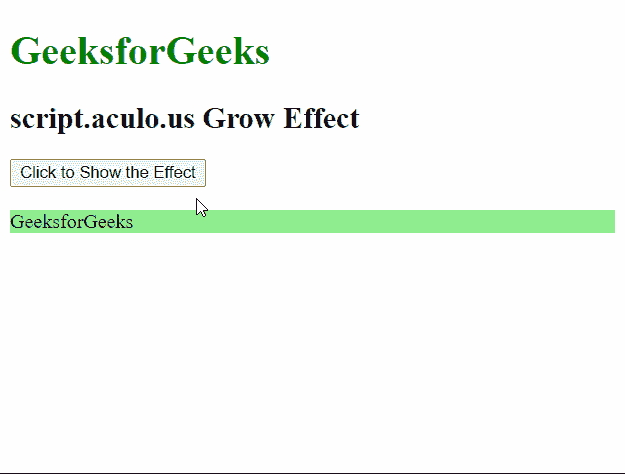
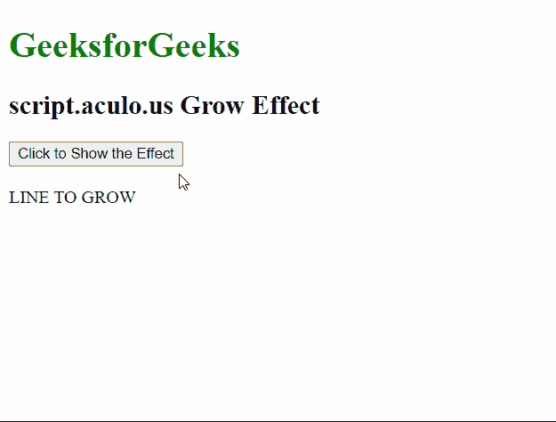

# 脚本 aculo.us 生长效果

> 原文:[https://www.geeksforgeeks.org/script-aculo-us-grow-effect/](https://www.geeksforgeeks.org/script-aculo-us-grow-effect/)

script.aculo.us 库是一个跨浏览器库，旨在改进网站的用户界面。在本文中，我们将演示**增长**效果。此效果用于使元素从一个方向平滑过渡地增长。我们也可以调整效果的持续时间。

**语法:**

```
Effect.Grow( 'id_of_element', [options] )
```

或者

```
Effect.Grow( element, [options] )
```

**选项:**该选项对象有两个值，如上所述，如下所述:

*   **方向:**该值指定元素生长的原点。这些值可以是“左上角”、“右上角”、“左下角”或“右下角”。默认值为“中心”。
*   **持续时间:**该值以秒为单位指定效果的持续时间。默认值为 1 秒。

为了演示这个函数的用法，我们编写了一小段代码。其中我们编写了一个名为 ShowEffect 方法的小 JavaScript 函数，它使用了这个库的 **Grow** 方法。以下示例演示了该方法。

**例 1:**

## 超文本标记语言

```
<!DOCTYPE html>
<html>

<head>
    <script type="text/javascript"
        src="prototype.js">
    </script>

    <script type="text/javascript"
        src="scriptaculous.js">
    </script>

    <script type="text/javascript">
        function ShowEffect(element) {

            // Using the Effect.Grow() method
            // on the element with no options
            new Effect.Grow(element);
        }
    </script>
</head>

<body>
    <h1 style="color: green;">
        GeeksforGeeks
    </h1>

    <h2>script.aculo.us Grow Effect</h2>

    <button onclick="ShowEffect('geeks_1')">
        Click to Show the Effect
    </button>
    <br />
    <br />

    <div id="geeks_1">
        <div style="background-color: lightgreen;">
            GeeksforGeeks
        </div>
    </div>
</body>

</html>
```

**输出:**



**例 2:**

## 超文本标记语言

```
<!DOCTYPE html>
<html>

<head>
    <script type="text/javascript"
        src="prototype.js">
    </script>

    <script type="text/javascript"
        src="scriptaculous.js">
    </script>

    <script type="text/javascript">
        function ShowEffect(element) {

            // Using the Effect.Grow() method
            // on the element with the direction
            // and duration specified
            new Effect.Grow(element, {
                direction: 'top-left',
                duration: 5
            });
        }
    </script>
</head>

<body>
    <h1 style="color: green;">
        GeeksforGeeks
    </h1>

    <h2>script.aculo.us Grow Effect</h2>

    <button onclick="ShowEffect('hideshow')">
        Click to Show the Effect
    </button>
    <br />
    <br />
    <div id="hideshow">
        LINE TO GROW
    </div>
</body>

</html>
```

**输出:**

