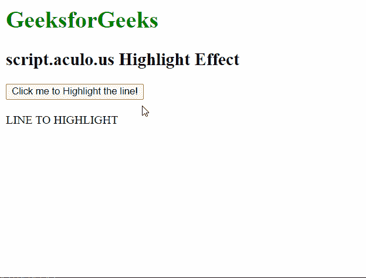
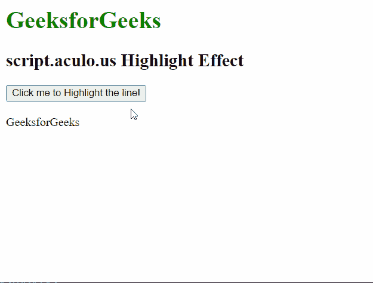

# script.aculo.us 高光效果

> 原文:[https://www . geesforgeks . org/script-aculo-us-highlight-effect/](https://www.geeksforgeeks.org/script-aculo-us-highlight-effect/)

script.aculo.us 库是一个跨浏览器库，旨在改善网站的用户界面。在本文中，我们将演示**高亮**效果。此效果用于使用可自定义的颜色使元素平滑突出显示。我们也可以调整效果的持续时间。

**语法:**

```
Effect.Highlight( 'id_of_element', [options] )
```

或者

```
Effect.Highlight( element, [options] )

```

**选项:**它有四个对象，如上所述，如下所述:

*   **startcolor:** 用于设置效果第一帧的颜色。默认值为“# ffff99”。
*   **endcolor:** 用于设置效果最后一帧的颜色。默认值为“# ffffff”。
*   **restorecolor:** 用于设置效果完成后元素的背景颜色。默认值是元素的当前背景色。
*   **keepBackgroundImage:** 用于设置是否保留元素上的任何背景图像。

为了演示这个函数的用法，我们编写了一小段代码。其中我们编写了一个名为 ShowEffect 方法的小 JavaScript 函数，它使用了这个库的**高亮**方法。以下示例演示了该方法。

**例 1:**

## 超文本标记语言

```
<!DOCTYPE html>
<html>

<head>
    <script type="text/javascript" 
        src="prototype.js">
    </script>

    <script type="text/javascript" 
        src="scriptaculous.js">
    </script>

    <script type="text/javascript">
        function ShowEffect(element) {

            // Using the Highlight effect with
            // the base options of the
            // Effect class
            new Effect.Highlight(element, {
                duration: 1,
                from: 0,
                to: 1.0
            });
        }
    </script>
</head>

<body>
    <h1 style="color: green;">
        GeeksforGeeks
    </h1>

    <h2>script.aculo.us Highlight Effect</h2>

    <button onclick="ShowEffect('hideshow')">
        Click me to Highlight the line!
    </button>

    <br />
    <br />
    <div id="hideshow">
        LINE TO HIGHLIGHT
    </div>
</body>

</html>
```

**输出:**



**例 2:**

## 超文本标记语言

```
<!DOCTYPE html>
<html>

<head>
    <script type="text/javascript" 
        src="prototype.js">
    </script>

    <script type="text/javascript" 
        src="scriptaculous.js">
    </script>

    <script type="text/javascript">
        function ShowEffect(element) {

            // Using the Highlight effect with
            // the startcolor and endcolor
            // options of the effect
            new Effect.Highlight(element, {
                startcolor: '#ff0000',
                endcolor: '#ffff00'
            });
        }
    </script>
</head>

<body>
    <h1 style="color: green;">
        GeeksforGeeks
    </h1>

    <h2>script.aculo.us Highlight Effect</h2>

    <button onclick="ShowEffect('geeks_1')">
        Click me to Highlight the line!
    </button>
    <br />
    <br />
    <div id="geeks_1">
        GeeksforGeeks
    </div>
</body>

</html>
```

**输出:**

