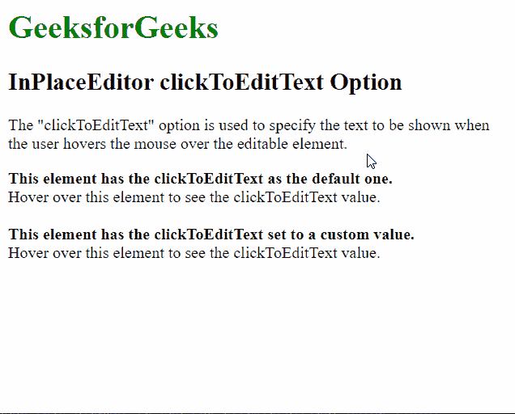

# script . aculo . us in place editor clickoedittext option

> 哎哎哎:# t0]https://www . geeksforgeeks . org/script-aculo-us-in place editor-clickoedittext 选项/

script.aculo.us 库是一个跨浏览器库，旨在改善网站的用户界面。Ajax。InPlaceEditor 用于使元素可编辑，从而允许用户编辑页面上的内容并将更改提交给服务器。

位置编辑器中的 **点击编辑文本** 选项用于指定当用户将鼠标悬停在可编辑元素上时要显示的文本。该选项的默认字符串为“点击编辑”。

**语法:**

```
{ clickToEditText : string }
```

**值:**该选项具有如上所述的单个值，如下所述:

*   **字符串:**这是一个字符串，指定当用户将鼠标悬停在可编辑元素上时要显示的文本。默认字符串 为“点击编辑”。

以下示例说明了在位置编辑器中单击编辑文本选项的使用。

**示例:**

## 超文本标记语言

```
<!DOCTYPE html>
<html>

<head>
    <script type="text/javascript"
        src="prototype.js">
    </script>

    <script type="text/javascript" 
        src="scriptaculous.js?load = controls">
    </script>

    <script type="text/javascript">
        window.onload = function () {

            // Default InplaceEditor with no
            // options
            new Ajax.InPlaceEditor(
                'editableElement',
                'http://localhost/tmpscripts/inplace.php',
            );

            // InplaceEditor with a modified
            // clickToEditText value
            new Ajax.InPlaceEditor(
                'editableElement2',
                'http://localhost/tmpscripts/inplace.php',
                {
                    // Specify the text to be used for 
                    // the hover text of the editor
                    clickToEditText: 
                        "Click here to start editing"
                }
            );
        }
    </script>
</head>

<body>
    <h1 style="color: green">
        GeeksforGeeks
    </h1>

    <h2>InPlaceEditor clickToEditText Option</h2>

    <p>
        The "clickToEditText" option is used to
        specify the text to be shown when the user
        hovers the mouse over the editable element.
    </p>

    <b>This element has the clickToEditText as
        the default one.</b>

    <div id="editableElement">
        Hover over this element to see the 
        clickToEditText value.
    </div>
    <br>
    <b>
        This element has the clickToEditText 
        set to a custom value.
    </b>

    <div id="editableElement2">
        Hover over this element to see the 
        clickToEditText value.
    </div>
</body>

</html>
```

下面的脚本是模拟将数据保存到服务器所需的 PHP 文件。

## 服务器端编程语言（Professional Hypertext Preprocessor 的缩写）

```
<?php
  if( isset($_REQUEST["value"]) ) {
    $str = $_REQUEST["value"];
    echo $str;
  }
?>
```

**输出:**

