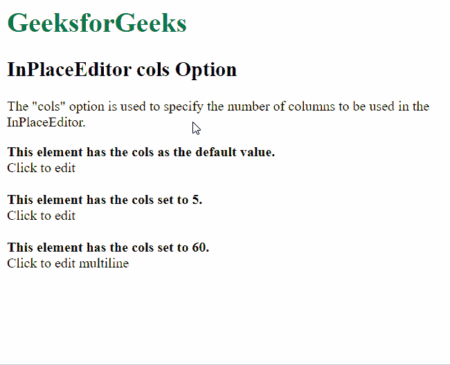

# 脚本。aculo . us in place editor cols option

> 原文:[https://www . geesforgeks . org/script-aculo-us-in placeeditor-cols-option/](https://www.geeksforgeeks.org/script-aculo-us-inplaceeditor-cols-option/)

script.aculo.us 库是一个跨浏览器库，旨在改进网站的用户界面。Ajax。InPlaceEditor 用于使元素可编辑，从而允许用户编辑页面上的内容并将更改提交给服务器。

位置编辑器中的 **列** 选项用于指定位置编辑器中显示的列数。此属性适用于单区域和多区域输入。

**语法:**

```
{ cols: value }
```

**参数:**该选项具有如上所述的单一值，如下所述:

*   **值:** 这是一个数字，用于指定要在编辑器中显示的列数。

以下示例说明了该选项的使用。

**示例:**

需要下面的脚本来模拟将数据保存到服务器。

## 服务器端编程语言（Professional Hypertext Preprocessor 的缩写）

```
<?php
  if( isset($_REQUEST["value"]) ) {
    $str = $_REQUEST["value"];
    echo $str;
  }
?>
```

下面的脚本通过示例演示了这一点:

## 超文本标记语言

```
<html>
<head>
  <script type="text/javascript
                " src="prototype.js">
  </script>
  <script type="text/javascript" 
          src="scriptaculous.js?load = controls">
  </script>
  <script type="text/javascript">
    window.onload = function () {

      // Default InplaceEditor with no
      // options
      new Ajax.InPlaceEditor(
        'editableElement',
        'http://localhost/tmpscripts/inplace.php',
      );

      // InplaceEditor with the cols
      // option changed to a custom value
      new Ajax.InPlaceEditor(
        'editableElement2',
        'http://localhost/tmpscripts/inplace.php',
        {

          // Specify the number of columns
          // to be used in the InplaceEditor
          cols: 5
        }
      );

      // InplaceEditor with the cols
      // option changed to a custom value
      new Ajax.InPlaceEditor(
        'editableElement3',
        'http://localhost/tmpscripts/inplace.php',
        {

          // Specify the number of columns
          // to be used in the InplaceEditor
          cols: 60
        }
      );
    }
  </script>
</head>
<body>
  <h1 style="color: green">
    GeeksforGeeks
  </h1>
  <h2>InPlaceEditor cols Option</h2>

<p>The "cols" option is used to specify
    the number of columns to be used in
    the InPlaceEditor.</p>

  <b>This element has the cols as the
    default value.</b>
  <div id="editableElement">Click to edit</div>
  <br>
  <b>This element has the cols set to 5.</b>
  <div id="editableElement2">Click to edit</div>
  <br>
  <b>This element has the cols set to 60.</b>
  <div id="editableElement3">
    Click to edit multiline
  </div>
</body>
</html>
```

**输出:**

