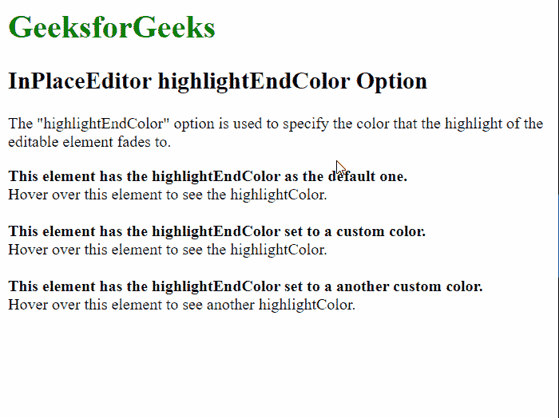

# 脚本. aculo . us in place editor highlightendcolor option

> 哎哎哎:# t0]https://www . geeksforgeeks . org/script-aculo-us-in place editor-highlightendcolor 选项/

script.aculo.us 库是一个跨浏览器库，旨在改进网站的用户界面。Ajax。InPlaceEditor 用于使元素可编辑，从而允许用户编辑页面上的内容并将更改提交给服务器。

位置编辑器中的 **选项用于指定可编辑元素的高光淡入的颜色。颜色必须用六个十六进制数字指定。默认颜色字符串为“#FFFFFF”。**

**语法:**

```
{ highlightEndColor : color }
```

**参数:**该选项具有如上所述的单一值，如下所述:

*   **颜色:**这是一个字符串，指定可编辑元素的高光渐变到的颜色。默认颜色字符串为“#FFFFFF”。

以下示例说明了该选项的使用。

**示例:**

需要下面的脚本来模拟将数据保存到服务器。

## 服务器端编程语言（Professional Hypertext Preprocessor 的缩写）

```
<?php
  if( isset($_REQUEST["value"]) ) {
    $str = $_REQUEST["value"];
    echo $str;
  }
?>
```

下面的脚本通过示例演示了这一点:

## 超文本标记语言

```
<html>
<head>
  <script type="text/javascript"
          src="prototype.js">
  </script>
  <script type="text/javascript" 
          src="scriptaculous.js?load = controls">
  </script>
  <script type="text/javascript">
    window.onload = function () {

      // Default InplaceEditor with no
      // options
      new Ajax.InPlaceEditor(
        'editableElement',
        'http://localhost/tmpscripts/inplace.php',
      );

      // InPlaceEditor with a custom color
      // assigned
      new Ajax.InPlaceEditor(
        'editableElement2',
        'http://localhost/tmpscripts/inplace.php',
        {

          // Specify the color to
          // be used to fade the 
          // highlight of the element
          highlightEndColor: "#FF0000"
        }
      );

      // InPlaceEditor with a custom color
      // assigned
      new Ajax.InPlaceEditor(
        'editableElement3',
        'http://localhost/tmpscripts/inplace.php',
        {

          // Specify the color to
          // be used to fade the 
          // highlight of the element
          highlightEndColor: "#00FFEC"
        }
      );
    }
  </script>
</head>
<body>
  <h1 style="color: green">
    GeeksforGeeks
  </h1>
  <h2>InPlaceEditor highlightEndColor Option</h2>

<p>The "highlightEndColor" option is used
    to specify the color that the highlight
    of the editable element fades to.</p>

  <b>This element has the highlightEndColor
    as the default one.</b>
  <div id="editableElement">Hover over this
    element to see the highlightColor.</div>
  <br>
  <b>This element has the highlightEndColor
    set to a custom color.</b>
  <div id="editableElement2">Hover over this
    element to see the highlightColor.</div>
  <br>
  <b>This element has the highlightEndColor
    set to a another custom color.</b>
  <div id="editableElement3">Hover over this
    element to see another highlightColor.</div>
</body>
</html>
```

**输出:**

