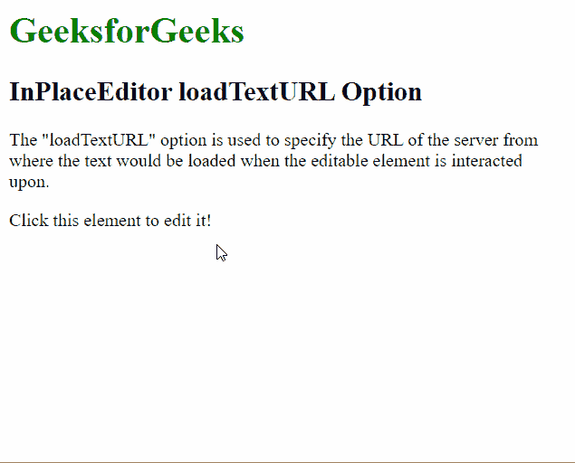

# 脚本. aculo . us in place editor load texture option

> 哎哎哎:# t0]https://www . geeksforgeeks . org/script-aculo-us-inlaceeditor-load texture 选项/

script.aculo.us 库是一个跨浏览器库，旨在改善网站的用户界面。Ajax。InPlaceEditor 用于使元素可编辑，从而允许用户编辑页面上的内容并将更改提交给服务器。

位置编辑器中的 **加载纹理** 选项用于指定当可编辑元素在上交互时将从其加载文本的服务器的网址。当服务器上的文本被格式化并要求加载到可编辑元素中时，这很有用。

**语法:**

```
{ loadTextURL: URL }
```

**值:**该选项具有如上所述的单个值，如下所述:

*   **网址:**这是一个字符串，指定用于加载文本的网址。默认值为*空值* 。

以下示例说明了该选项的使用。

**示例:**该示例演示了 InPlaceEditor loadTextURL 选项。

## 超文本标记语言

```
<!DOCTYPE html>
<html>

<head>
    <script type="text/javascript" 
        src="prototype.js">
    </script>

    <script type="text/javascript" 
        src="scriptaculous.js?load = controls">
    </script>

    <script type="text/javascript">
        window.onload = function () {
            new Ajax.InPlaceEditor(
                'editableElement',

                // Script for the functioning
                // of the editor
                'http://localhost/inplace.php',
                {

                    // Specify the script from 
                    // where the text would be 
                    // loadec
                    loadTextURL:
                    'http://localhost/loadText.php',
                }
            );
        }
    </script>
</head>

<body>
    <h1 style="color: green">
        GeeksforGeeks
    </h1>

    <h2>InPlaceEditor loadTextURL Option</h2>

    <p>
        The "loadTextURL" option is used to 
        specify the URL of the server from 
        where the text would be loaded when 
        the editable element is interacted 
        upon.
    </p>

    <div id="editableElement">
        Click this element to edit it!
    </div>
</body>

</html>
```

需要文件**inplace.php**来模拟将数据保存到服务器。

## 服务器端编程语言（Professional Hypertext Preprocessor 的缩写）

```
<?php
  if( isset($_REQUEST["value"]) ) {
    $str = $_REQUEST["value"];
    echo $str;
  }
?>
```

需要文件**loadText.php**来模拟加载文本的服务器。

## 服务器端编程语言（Professional Hypertext Preprocessor 的缩写）

```
<?php

  // Sleep is used to simulate the delay of
  // the server request 
  sleep(1);

  echo "This is the text from the server!";
?>
```

**输出:**

