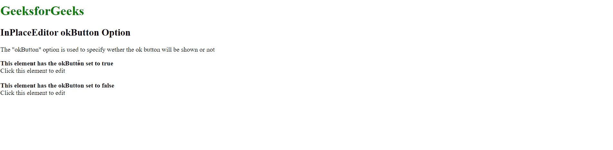

# script . aculo . us in placeeditor ok button 选项

> 原文:[https://www . geesforgeks . org/script-aculo-us-in placeeditor-ok button-option/](https://www.geeksforgeeks.org/script-aculo-us-inplaceeditor-okbutton-option/)

script.aculo.us 库是一个跨浏览器库，旨在改进网站的用户界面。Ajax。InPlaceEditor 用于使元素可编辑，从而允许用户编辑页面上的内容并将更改提交给服务器。

位置编辑器中的**确定按钮**选项用于指定是否显示用于保存更改并将更改提交给服务器的按钮。默认值设置为真。

**语法:**

```
{ okButton : boolean }
```

**值**:该选项具有如上所述的单个值，如下所述:

**布尔值**:这是一个布尔值，指定是否显示用于向服务器提交更改的按钮。默认值设置为真。

以下示例说明了该选项的使用。

**示例:**下面的 HTML 文件演示了这个示例:

## 超文本标记语言

```
<html> 

<head> 
    <script type="text/javascript" 
        src="javascript/prototype.js"> 
    </script> 

    <script type="text/javascript" 
        src="javascript/scriptaculous.js?load = controls"> 
    </script> 

    <script type="text/javascript"> 
        window.onload = function () { 

            // InplaceEditor with okButton 
            // option set to true 
            new Ajax.InPlaceEditor( 
                'editableElement', 
                'inplace.php', 
                {
                    okButton: true
                }
            ); 

            // InplaceEditor with okButton 
            // option set to false 
            new Ajax.InPlaceEditor( 
                'editableElement2', 
                'inplace.php', 
                { 

                    // Specify the boolean value
                    // wether the button will be shown or not 
                    okButton: false
                } 
            ); 
        } 
    </script> 
</head> 

<body> 
    <h1 style="color: green"> 
        GeeksforGeeks 
    </h1> 

    <h2>InPlaceEditor okButton Option</h2> 

<p> 
        The "okButton" option is used to specify 
        wether the ok button will be shown or not 
    </p>

    <b> 
        This element has the okButton set to true 
    </b> 

    <div id="editableElement"> 
        Click this element to edit 
    </div> 
    <br> 

    <b> 
        This element has the okButton set to false
    </b> 

    <div id="editableElement2"> 
        Click this element to edit 
    </div> 
</body> 

</html> 
```

## 服务器端编程语言（Professional Hypertext Preprocessor 的缩写）

```
<?php 
  if( isset($_REQUEST["value"]) ) { 
    $str = $_REQUEST["value"]; 
    echo $str; 
  } 
?>
```

**输出:**

