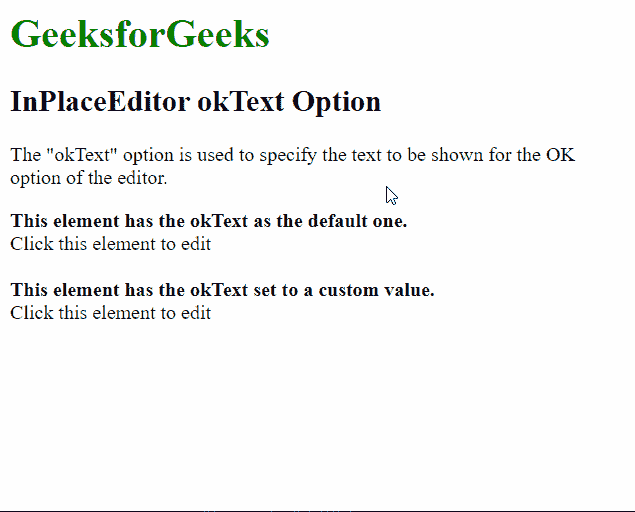

# 脚本. aculo.us InPlaceEditor 十月文本选项

> 原文:[https://www . geesforgeks . org/script-aculo-us-in placeeditor-oktext-option/](https://www.geeksforgeeks.org/script-aculo-us-inplaceeditor-oktext-option/)

script.aculo.us 库是一个跨浏览器库，旨在改进网站的用户界面。Ajax。InPlaceEditor 用于使元素可编辑，从而允许用户编辑页面上的内容并将更改提交给服务器。

位置编辑器中的**确定文本**选项用于指定按钮上的文本，该按钮用于保存更改并将更改提交给服务器。默认字符串是“ok”。

**语法:**

```
{ okText : string }
```

**值:**该选项具有如上所述的单个值，如下所述:

*   **字符串:**这是一个字符串，它指定了用于向服务器提交更改的按钮要显示的文本。默认字符串是“ok”。

以下示例说明了该选项的使用。

**示例:**

下面的 HTML 文件演示了这个例子:

## 超文本标记语言

```
<html>

<head>
    <script type="text/javascript"
        src="prototype.js">
    </script>

    <script type="text/javascript"
        src="scriptaculous.js?load = controls">
    </script>

    <script type="text/javascript">
        window.onload = function () {

            // Default InplaceEditor with no
            // options
            new Ajax.InPlaceEditor(
                'editableElement',
                'http://localhost/tmpscripts/inplace.php',
            );

            // InplaceEditor with the
            // okText modified
            new Ajax.InPlaceEditor(
                'editableElement2',
                'http://localhost/tmpscripts/inplace.php',
                {

                    // Specify the text to be used for
                    // the button to submit changes
                    okText: "Click to confirm the edit"
                }
            );
        }
    </script>
</head>

<body>
    <h1 style="color: green">
        GeeksforGeeks
    </h1>

    <h2>InPlaceEditor okText Option</h2>

<p>
        The "okText" option is used to specify
        the text to be shown for the OK option
        of the editor.
    </p>

    <b>
        This element has the okText as the
        default one.
    </b>

    <div id="editableElement">
        Click this element to edit
    </div>
    <br>

    <b>
        This element has the okText set to a
        custom value.
    </b>

    <div id="editableElement2">
        Click this element to edit
    </div>
</body>

</html>
```

下面的 PHP 文件演示了这个例子:

## 服务器端编程语言（Professional Hypertext Preprocessor 的缩写）

```
<?php
  if( isset($_REQUEST["value"]) ) {
    $str = $_REQUEST["value"];
    echo $str;
  }
?>
```

**输出:**

