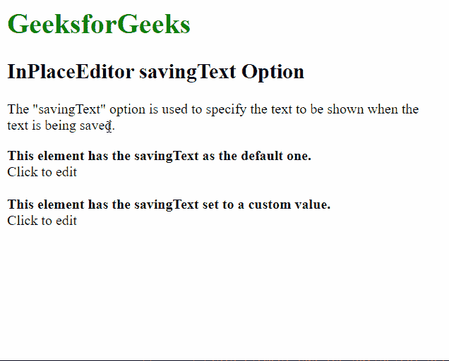

# script . aculo . us in placeeditor saving text 选项

> 原文:[https://www . geesforgeks . org/script-aculo-us-in placeeditor-saving text-option/](https://www.geeksforgeeks.org/script-aculo-us-inplaceeditor-savingtext-option/)

script.aculo.us 库是一个跨浏览器库，旨在改进网站的用户界面。Ajax。InPlaceEditor 用于使元素可编辑，从而允许用户编辑页面上的内容并将更改提交给服务器。

位置编辑器中的 **保存文本** 选项用于指定文本发送到服务器保存时要显示的文本。该选项的默认字符串为“保存… ”。

**语法:**

```
{ savingText : value }
```

**参数:**该选项具有如上所述的单一值，如下所述:

*   **值:**这是一个字符串，指定了文本发送到服务器时要显示的文本。默认字符串 为“保存……”。

以下示例说明了该选项的使用。

**示例:**需要下面的脚本来模拟将数据保存到服务器。

## 服务器端编程语言（Professional Hypertext Preprocessor 的缩写）

```
<?php

  // Simulate the time taken by
  // the server
  sleep(1);

  if( isset($_REQUEST["value"]) ) {
    $str = $_REQUEST["value"];
    echo $str;
  }
?>
```

下面的脚本通过示例演示了这一点:

## 超文本标记语言

```
<!DOCTYPE html>
<html>

<head>
    <script type="text/javascript" 
        src="prototype.js">
    </script>

    <script type="text/javascript" 
        src="scriptaculous.js?load = controls">
    </script>

    <script type="text/javascript">
        window.onload = function () {

            // Default InplaceEditor with no
            // options
            new Ajax.InPlaceEditor(
                'editableElement',
                'http://localhost/tmpscripts/inplace.php',
            );

            // InplaceEditor with the savingText
            // option changed to a custom value
            new Ajax.InPlaceEditor(
                'editableElement2',
                'http://localhost/tmpscripts/inplace.php',
                {

                    // Specify the text to be used
                    // while sending to server
                    savingText: "Saving the contents..."
                }
            );
        }
    </script>
</head>

<body>
    <h1 style="color: green">
        GeeksforGeeks
    </h1>

    <h2>InPlaceEditor savingText Option</h2>

    <p>
        The "savingText" option is used to
        specify the text to be shown when the
        text is being saved.
    </p>

    <b>
        This element has the savingText as
        the default one.
    </b>

    <div id="editableElement">Click to edit</div>
    <br>

    <b>
        This element has the savingText
        set to a custom value.
    </b>

    <div id="editableElement2">Click to edit</div>
</body>

</html>
```

**输出:**

