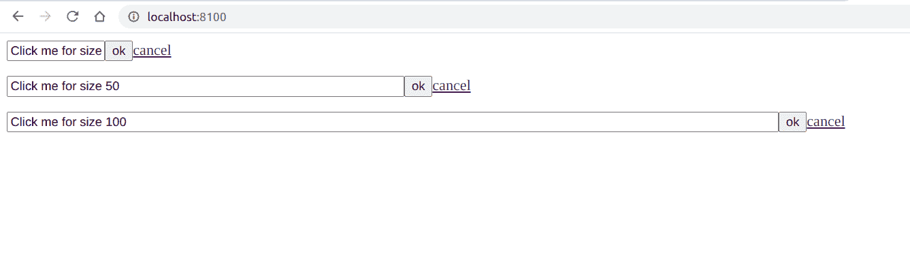

# script . aculo . us in placeeditor 大小选项

> 原文:[https://www . geesforgeks . org/script-aculo-us-in placeeditor-size-option/](https://www.geeksforgeeks.org/script-aculo-us-inplaceeditor-size-option/)

**script.aculo.us** 是一个跨浏览器库，旨在改善网站的用户界面。**阿贾克斯。InPlaceEditor** 用于使元素可编辑，从而允许用户编辑页面上的内容并将更改提交给服务器。

位置编辑器 *尺寸*选项用于定义可编辑字段的宽度。

**语法:**

```
{ size: value }
```

**参数:**该选项有一个如上所述的单一值，如下所述。

*   **值:**这是一个定义可编辑字段宽度的数字。

**示例:**

要演示此功能的使用，请参考以下代码。代码的 JavaScript 部分将为特定元素创建一个就地编辑器。点击*点击我的尺寸 10* ，你会看到原位编辑器和设定的尺寸。

## 超文本标记语言

```
<!DOCTYPE html>
<html>

<head>
    <!-- Include the required scripts -->
    <script type="text/javascript"
        src="prototype.js"> 
    </script> 

    <script type="text/javascript"
        src="scriptaculous.js?load = effects,controls"> 
    </script> 
</head>

<body>
    <p id="editme1">Click me for size 10</p>

    <p id="editme2">Click me for size 50</p>

    <p id="editme3">Click me for size 100</p>

    <!-- JavaScript part to initialize the objects -->
    <script type="text/javascript">
        new Ajax.InPlaceEditor('editme1', 
            'test.html', { size: 10 });

        new Ajax.InPlaceEditor('editme2', 
            'test.html', { size: 50 });

        new Ajax.InPlaceEditor('editme3', 
            'test.html', { size: 50 });
    </script>
</body>

</html>
```

**输出:**

*   **点击按钮前:**
    
*   **点击按钮后:**
    

**test.html**以下代码是上述 html 代码中使用的文件“test.html”的内容。

```
<!DOCTYPE html> 
<html> 

<body> 
    GeeksforGeeks
</body> 

</html> 
```