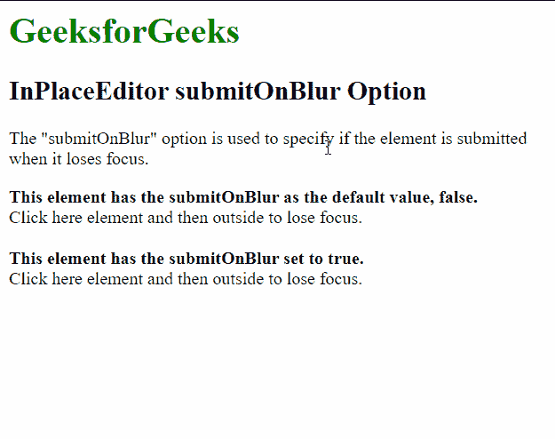

# script . aculo . us in placeeditor submit onbull 选项

> 原文:[https://www . geesforgeks . org/script-aculo-us-in placeeditor-submit onblor-option/](https://www.geeksforgeeks.org/script-aculo-us-inplaceeditor-submitonblur-option/)

script.aculo.us 库是一个跨浏览器库，旨在改进网站的用户界面。Ajax。InPlaceEditor 用于使元素可编辑，从而允许用户编辑页面上的内容并将更改提交给服务器。

位置编辑器中的**提交按钮**选项用于指定当元素失去焦点时是否提交该元素的编辑器表单。该选项的默认值为“false”，即表单失去焦点时不会提交。

**语法:**

```
{ submitOnBlur: value }
```

**参数:**该选项具有如上所述的单一值，如下所述:

*   **值:**这是一个布尔值，指定当输入表单失去焦点时是否提交。默认值为“假”。

以下示例说明了该选项的使用。

**示例:**需要下面的脚本来模拟将数据保存到服务器。

## 服务器端编程语言（Professional Hypertext Preprocessor 的缩写）

```
<?php
  if( isset($_REQUEST["value"]) ) {
    $str = $_REQUEST["value"];
    echo $str;
  }
?>
```

下面的脚本通过示例演示了这一点:

## 超文本标记语言

```
<html>
<head>
  <script type="text/javascript" 
          src="prototype.js">
  </script>
  <script type="text/javascript" 
          src="scriptaculous.js?load = controls">
  </script>
  <script type="text/javascript">
    window.onload = function () {
      new Ajax.InPlaceEditor(
        'editableElement',
        'http://localhost/tmpscripts/inplace.php',
        {

          // Setting submitOnBlur
          // to false, to prevent
          // submitting when losing focus
          submitOnBlur: false,
        }
      );

      new Ajax.InPlaceEditor(
        'editableElement2',
        'http://localhost/tmpscripts/inplace.php',
        {

          // Setting submitOnBlur
          // to true, submits
          // when focus is lost
          submitOnBlur: true,
        }
      );

    }
  </script>
</head>
<body>
  <h1 style="color: green">
    GeeksforGeeks
  </h1>
  <h2>InPlaceEditor submitOnBlur Option</h2>
  <p>The "submitOnBlur" option is used to 
    specify if the element is submitted
    when it loses focus.</p>
  <b>
    This element has the submitOnBlur as 
    the default value, false.
  </b>
  <div id="editableElement">Click here element
    and then outside to lose focus.</div>
  <br>
  <b>This element has the submitOnBlur set
    to true.</b>
  <div id="editableElement2">Click here element
    and then outside to lose focus.</div>
</body>
</html>
```

**输出:**

