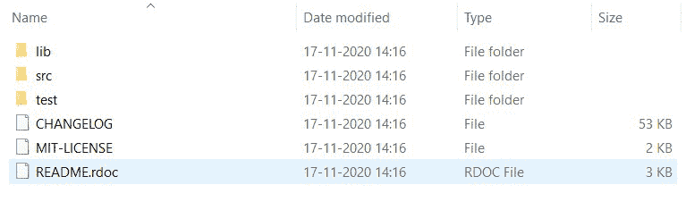
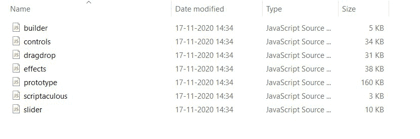

# script.aculo.us 安装

> 原文:[https://www.geeksforgeeks.org/script-aculo-us-installation/](https://www.geeksforgeeks.org/script-aculo-us-installation/)

**什么是脚本 aculo.us？**

script.aculo.us 是一组开源的 JavaScript 库，旨在增强网站的用户界面。它通过文档对象模型(DOM)提供视觉效果引擎、拖放库、控件(滑块、就地编辑、基于 Ajax 的自动完成)等。托马斯·富克斯于 2005 年 6 月首次向公众发布。

**为什么是 script.aculo.us？**

1.  可以添加或创建视觉效果。
2.  控件提供多个用户界面元素。
3.  生成器允许轻松创建 DOM 元素。

**特点**T2**1。视觉效果:**它有二十五种视觉效果和七种过渡模式，其中五种核心效果是不透明、缩放、移动、高亮和平行。此外，程序员可以扩展现有的并创建新的效果。

**2。控制:**

1.  它使拖放模块的创建更加容易。
2.  它提供自动完成输入字段。
3.  它还允许就地编辑，等等。

**3。声音:**它可以让你播放声音，使用多首曲目，排队，还能提供更多。

**4。可移植性:**script . aculo . us 框架的所有代码都是用 JavaScript 编写的，它运行在当今大多数可用的平台上。

**5。script.aculo.us 的受欢迎程度:** script.aculo.us 被许多受欢迎的组织使用，如 NASA、苹果、宜家、古驰、Shopify、Ruby on Rails 等。因此，它被认为是可靠和高效的。

**安装 script.aculo.us:** 安装 script.aculo.us 很容易。此外，对于大多数可用的平台来说也是如此，因此不需要担心您在哪个操作系统平台上。只需遵循下面给出的步骤:

*   从[下载页面](http://script.aculo.us/downloads)下载 script.aculo.us zip 文件。
*   提取下载的包。提取后，您会发现这些文件和文件夹如下所示。



提取的文件和文件夹

*   现在将 **src** 文件夹中的所有文件复制到您的项目文件夹中(sound.js 和 unittest.js 是可选的)。它会有这些文件；builder.js、controls.js、dragdrop.js、effects.js、scriptaculous.js、sound.js、unittest.js 和 slider.js。
*   同时将原型. js 从 **lib** 文件夹复制到你的项目文件夹中。



项目文件夹中的必需文件

**用法:**您已经准备好在项目中使用 script.aculo.us 库。现在让我们看看如何使用它:

*   如下图所示，在您的项目中加载**原型. js** 和 **scriptaculous.js** 。

## 超文本标记语言

```
<!DOCTYPE html>
<html>

<head>
    <title>script.aculo.us usage</title>

    <!-- Load the the javascript files
    that we copied earlier during installation -->
    <script type="text/javascript"
        src="./prototype.js">
    </script>

    <script type="text/javascript"
        src="./scriptaculous.js">
    </script>
</head>

<body>
    <!-- YOUR CODE -->
</body>

</html>
```

*   现在你可以使用所有可用的功能，如高光效果。更多信息可以在官方[文档网站](http://madrobby.github.io/scriptaculous/)上找到。

> end color:' # ffffff ' })；返回 false”>
> 突出我！
> T4/a>

**注意:**也可以修改给定代码中的脚本标签，只加载需要的特性。让我们看一个例子:

## 超文本标记语言

```
<!DOCTYPE html>
<html>

<head>
    <title>script.aculo.us usage</title>

    <!-- Here we're loading visual effects
         and dragdrop features only -->
    <script type="text/javascript"
        src="./prototype.js">
    </script>

    <!-- The scripts that can be specified are:
        builder, effects, dragdrop, controls,
        and slider -->
    <script type="text/javascript"
        src="./scriptaculous.js?load = effects, dragdrop">
    </script>
</head>

<body>
    <!-- YOUR CODE -->
</body>

</html>
```

**script . aculo . us 库的好处:**

*   让发展更快。
*   轻巧易用。