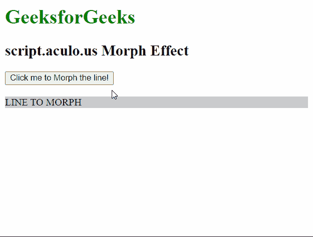
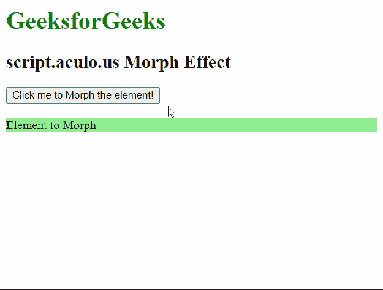

# 脚本. aculo.us 变形效果

> 原文:[https://www.geeksforgeeks.org/script-aculo-us-morph-effect/](https://www.geeksforgeeks.org/script-aculo-us-morph-effect/)

script.aculo.us 库是一个跨浏览器库，旨在改进网站的用户界面。在本文中，我们将演示**变形**效果。此效果用于将元素的 CSS 样式平滑地更改为作为参数给定的样式。我们也可以调整效果的持续时间。

**语法:**

```
Effect.Morph( 'element', [options] )

```

**参数:**该效果在下面描述的选项对象中有一个参数:

*   **样式:**这代表效果平滑变化的 CSS 样式。

为了演示这个函数的用法，我们编写了一小段代码。其中，我们编写了一个名为 ShowEffect 方法的小 JavaScript 函数，它使用了这个库的 **Morph** 方法。以下示例演示了该方法。

**例 1:**

## 超文本标记语言

```
<!DOCTYPE html>
<html>

<head>
    <script type="text/javascript" 
        src="prototype.js">
    </script>

    <script type="text/javascript" 
        src="scriptaculous.js">
    </script>

    <script type="text/javascript">
        function ShowEffect(element) {

            // Using the Morph effect by specifying
            // new CSS styles
            new Effect.Morph(element, {
                style: 'background: #f00; color: #fff;'
            });
        }
    </script>
</head>

<body>
    <h1 style="color: green;">
        GeeksforGeeks
    </h1>

    <h2>script.aculo.us Morph Effect</h2>

    <button onclick="ShowEffect('hideshow')">
        Click me to Morph the line!
    </button>
    <br />
    <br />

    <div id="hideshow" style="background:#cccccc;">
        LINE TO MORPH
    </div>
</body>

</html>
```

**输出:**



**例 2:**

## 超文本标记语言

```
<!DOCTYPE html>
<html>

<head>
    <script type="text/javascript" 
        src="prototype.js">
    </script>

    <script type="text/javascript" 
        src="scriptaculous.js">
    </script>

    <script type="text/javascript">
        function ShowEffect(element) {

            // Using the Morph effect by 
            // specifying new CSS styles
            new Effect.Morph(element, {
                style: 
'height: 100px; width: 150px; color: #FF0000;'
            });
        }
    </script>
</head>

<body>
    <h1 style="color: green;">
        GeeksforGeeks
    </h1>

    <h2>script.aculo.us Morph Effect</h2>

    <button onclick="ShowEffect('hideshow')">
        Click me to Morph the element!
    </button>
    <br />
    <br />

    <div id="hideshow" style=
        "background: lightgreen;">
        Element to Morph
    </div>
</body>

</html>
```

**输出:**

