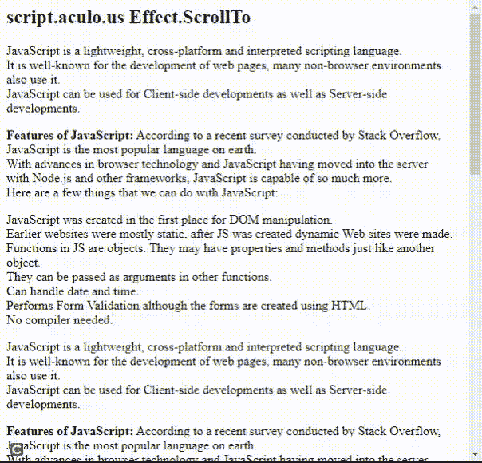

# 脚本. aculo.us ScrollTo Effect

> 原文:[https://www . geesforgeks . org/script-aculo-us-scrollto-effect/](https://www.geeksforgeeks.org/script-aculo-us-scrollto-effect/)

在本文中，我们将通过使用名为 **script.aculo.us** 的 JavaScript 库来演示 **ScrollTo** 的效果，实现从一个到另一个的平滑过渡。我们也可以调整效果的持续时间。

**语法:**

```
Effect.ScrollTo('element_id', { duration:'0.2', offset:-20 });
```

**注意:**要使用这个库，我们应该安装这个库，然后在我们的程序中使用它。要做到这一点，你可以跟随这个链接[http://script.aculo.us/downloads](http://script.aculo.us/downloads)。

**方法:**为了演示这个函数的使用，我们编写了一小段代码。我们已经编写了一个名为 **ShowEffect()** 的小 JavaScript 函数，该函数使用了**效果。本库的 ScrollTo()** 方法。点击*点击我滚动！*，你会看清楚效果的。

**示例:**要看效果，先下载库，然后在本地环境打开这个程序。

## 超文本标记语言

```
<!DOCTYPE html>
<html>

<head>
    <script type="text/javascript" 
        src="prototype.js">
    </script>

    <script type="text/javascript" 
        src="scriptaculous.js">
    </script>

    <script type="text/javascript">

        function ShowEffect(element) {
            new Effect.ScrollTo(element, 
            { duration: '0.2', offset: -20 });
        }          
    </script>
</head>

<body>
    <h2>script.aculo.us Effect.ScrollTo</h2>
    <p>
        JavaScript is a lightweight, cross-platform 
        and interpreted scripting language.<br />
        It is well-known for the development of web 
        pages, many non-browser environments also 
        use it.<br />JavaScript can be used for 
        Client-side developments as well as 
        Server-side developments.<br />
    </p>

    <p>
        <b>Features of JavaScript:</b> According to
        a recent survey conducted by Stack Overflow,
        <br />JavaScript is the most popular language 
        on earth.<br />With advances in browser 
        technology and JavaScript having moved into 
        the server<br />with Node.js and other 
        frameworks, JavaScript is capable of so much 
        more.<br /> Here are a few things that we can 
        do with JavaScript:<br />
    </p>

    <p>
        JavaScript was created in the first place
        for DOM manipulation.<br /> Earlier websites 
        were mostly static, after JS was created
        dynamic Web sites were made.<br /> Functions 
        in JS are objects. They may have properties 
        and methods just like another object.<br />
        They can be passed as arguments in other 
        functions.<br />Can handle date and time.<br />
        Performs Form Validation although the forms are
        created using HTML.<br />No compiler needed.<br />
    </p>

    <p>
        JavaScript is a lightweight, cross-platform and
        interpreted scripting language.<br />
        It is well-known for the development of web pages,
        many non-browser environments also use it.<br />
        JavaScript can be used for Client-side
        developments as well as Server-side 
        developments.<br />
    </p>

    <p>
        <b>Features of JavaScript:</b> According
        to a recent survey conducted by Stack 
        Overflow,<br /> JavaScript is the most 
        popular language on earth.<br />
        With advances in browser technology and
        JavaScript having moved into the server<br />
        with Node.js and other frameworks,
        JavaScript is capable of so much more.<br />
        Here are a few things that we can do
        with JavaScript:<br />
    </p>

    <p>
        JavaScript was created in the first place
        for DOM manipulation.<br /> Earlier websites
        were mostly static, after JS was created 
        dynamic Web sites were made.<br />
        Functions in JS are objects. They may have
        properties and methods just like another
        object.<br /> They can be passed as arguments 
        in other functions.<br /> Can handle date 
        and time.<br />Performs Form Validation 
        although the forms are created using HTML.<br />
        No compiler needed.<br />
    </p>

    <p>
        JavaScript is a lightweight, cross-platform
        and interpreted scripting language.<br />
        It is well-known for the development of
        web pages, many non-browser environments
        also use it.<br /> JavaScript can be used
        for Client-side developments as
        well as Server-side developments.<br />
    </p>

    <p>
        <b>Features of JavaScript:</b> According to a
        recent survey conducted by Stack Overflow,<br />
        JavaScript is the most popular language on 
        earth.<br />With advances in browser technology 
        and JavaScript having moved into the server<br />
        with Node.js and other frameworks,JavaScript is
        capable of so much more.<br />Here are a few 
        things that we can do with JavaScript.<br />
    </p>

    <p>
        JavaScript was created in the first place for
        DOM manipulation.<br /> Earlier websites were
        mostly static,after JS was created dynamic 
        Web sites were made.<br />Functions in JS are 
        objects. They may have properties and methods 
        just like another object.<br />They can be 
        passed as arguments in other functions.<br />
        Can handle date and time.<br />
        Performs Form Validation although the forms are
        created using HTML.<br />
        No compiler needed.<br />
    </p>

    <p>
        JavaScript is a lightweight, cross-platform and
        interpreted scripting language.<br />
        It is well-known for the development of web pages,
        many non-browser environments also use it.<br />
        JavaScript can be used for Client-side developments
        as well as Server-side developments.<br />
    </p>

    <a href="#" onclick="ShowEffect('h2'); return false;">
        Click me to scroll!
    </a>
</body>

</html>
```

**输出:**

