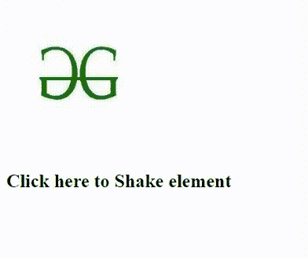

# 脚本. aculo.us 摇动效果

> 原文:[https://www.geeksforgeeks.org/script-aculo-us-shake-effect/](https://www.geeksforgeeks.org/script-aculo-us-shake-effect/)

这个效果属于 **JavaScript 的 UI** 库名为 script . aculo . us . script . aculo . us 是一个建立在 Prototype JavaScript Framework 上的 JavaScript 库。这个库在**文档对象模型**的帮助下给了我们动态的视觉效果。

现在让我们具体了解一下**脚本**

抖动效果使目标图像前后移动三次。让我们看看这个效果和 HTML 的实际实现。

**语法:**

```
new Effect.Shake('id_of_element', [options]);
OR
new Effect.Shake(element, [options]);
```

**示例:**

```
<html>
    <head>
        <title>script.aculo.us Shake Effect</title>

        <!-- Adding required scripts for Shake Effect -->
        <script type="text/javascript" 
                src="/javascript/prototype.js"></script>
        <script type="text/javascript" 
                src=
             "/javascript/scriptaculous.js?load = effects">
      </script>
        <script type="text/javascript">

            <!-- script.aculo.us - Shake Effect -->
             function ShakeEffect(element){
                new Effect.Shake(element);
             }
        </script>
    </head>

    <body>
        <!-- HTML division with
             id and onclick functionality-->
        <div id="myimage" onclick="ShakeEffect(this);">
            
            <h2>Click here to Shake element</h2>
        </div>
    </body>
</html>
```

**输出:**点击那个文字，图像会抖动。

