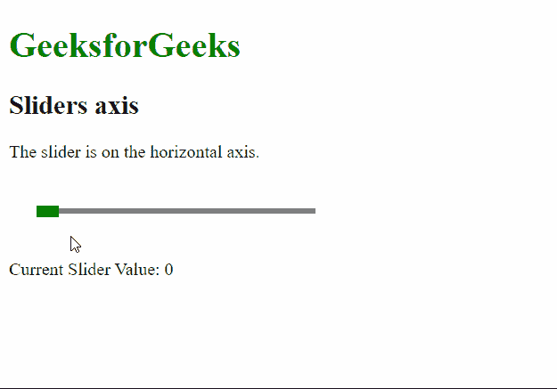
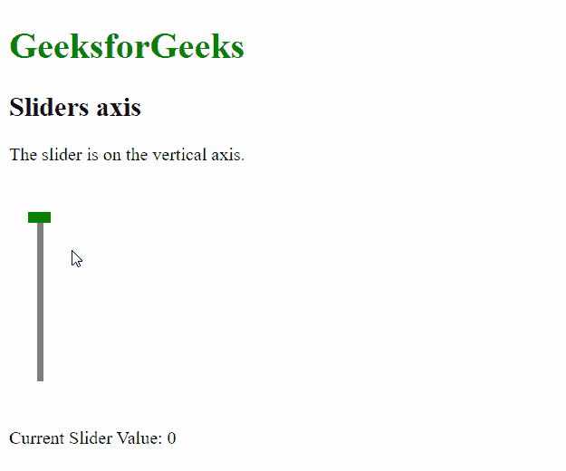

# 脚本. aculo.us 滑块轴选项

> 原文:[https://www . geesforgeks . org/script-aculo-us-sliders-axis-option/](https://www.geeksforgeeks.org/script-aculo-us-sliders-axis-option/)

script.aculo.us 库是一个跨浏览器库，旨在改善网站的用户界面。滑块控件是允许用户输入值的细轨迹。这是通过定义一个值的范围来完成的，用户可以通过将手柄拖动到适当的值来选择该范围。

**滑块轴** 选项用于定义滑块应该移动的轴或方向。该选项接受一个字符串值，该值可根据所需方向设置为“水平”或“垂直”。

**语法:**

```
{ axis : horizontal | vertical }

```

**值:**该选项有两个值，如上所述，描述如下:

*   **水平:**这将定义滑块的方向为水平。这是默认值。
*   **垂直:**这将定义滑块的方向为垂直。

**例 1:**

## 超文本标记语言

```
<!DOCTYPE html>
<html>

<head>
    <!-- Include the required scripts -->
    <script type="text/javascript" 
        src="prototype.js">
    </script>

    <script type="text/javascript" 
src="scriptaculous.js?load = slider">
    </script>

    <!-- Style the Sliders so that they
        are properly visible -->
    <style type="text/css">
        .track {
            width: 250px;
            background-color: gray;
            height: 5px;
            position: relative;
        }

        .track .handle {
            width: 20px;
            height: 10px;
            background-color: green;
            cursor: move;
            position: absolute;
            top: -2px;
        }

        .pad {
            padding: 25px;
        }
    </style>
</head>

<body>
    <h1 style="color: green;">
        GeeksforGeeks
    </h1>

    <h2>Sliders axis</h2>

    <p>
        The slider is on the 
        horizontal axis.
    </p>

    <div class="pad">
        <div id="track-hor" class="track">
            <div id="handle-hor" class="handle">
            </div>
        </div>
    </div>

    <p>Current Slider Value:
        <span id="out">0</span>
    </p>

    <script type="text/javascript">
        new Control.Slider('handle-hor',
            'track-hor', {
            range: $R(1, 100),

            // Set the axis of the slider
            // to be horizontal 
            axis: 'horizontal',

            onSlide: (val) => {
                document.querySelector("#out")
                    .textContent = val;
            }
        });
    </script>
</body>

</html>
```

**输出:**



**例 2:**

## 超文本标记语言

```
<!DOCTYPE html>
<html>

<head>
    <!-- Include the required scripts -->
    <script type="text/javascript" 
        src="prototype.js">
    </script>

    <script type="text/javascript" 
src="scriptaculous.js?load = slider">
    </script>

    <!-- Style the Sliders so that they
        are properly visible -->
    <style type="text/css">
        .track {
            width: 5px;
            background-color: gray;
            height: 150px;
            position: relative;
        }

        .track .handle {
            width: 20px;
            height: 10px;
            background-color: green;
            cursor: move;
            position: absolute;
            left: -8px;
        }

        .pad {
            padding: 25px;
        }
    </style>
</head>

<body>
    <h1 style="color: green;">
        GeeksforGeeks
    </h1>

    <h2>Sliders axis</h2>

    <p>The slider is on the vertical axis.</p>

    <div class="pad">
        <div id="track-vert" class="track">
            <div id="handle-vert" class="handle">
            </div>
        </div>
    </div>

    <p>Current Slider Value:
        <span id="out">0</span>
    </p>

    <script type="text/javascript">

        new Control.Slider('handle-vert',
            'track-vert', {
            range: $R(1, 100),

            // Set the axis of the slider
            // to be vertical 
            axis: 'vertical',

            onSlide: (val) => {
                document.querySelector("#out")
                    .textContent = val;
            }
        });
    </script>
</body>

</html>
```

**输出:**

