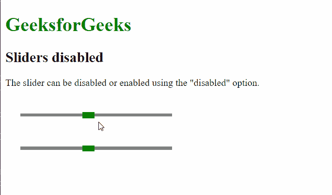

# 脚本 aculo.us 滑块禁用选项

> 原文:[https://www . geesforgeks . org/script-aculo-us-sliders-disabled-option/](https://www.geeksforgeeks.org/script-aculo-us-sliders-disabled-option/)

script.aculo.us 库是一个跨浏览器库，旨在改善网站的用户界面。滑块控件是允许用户输入值的细轨迹。这是通过定义一个值的范围来完成的，用户可以通过将手柄拖动到适当的值来选择该范围。

**滑块禁用** 选项用于定义给定滑块是否禁用。禁用的滑块将被锁定，因此用户无法移动。该选项接受一个布尔值，其中值**为真**指定要禁用的滑块，**为假**指定它不是禁用的。

**语法:**

```
{ disabled: boolean }

```

**值:**

*   **布尔值:**这是一个布尔值，指定滑块是否被禁用。

**示例:**

## 超文本标记语言

```
<!DOCTYPE html>
<html>

<head>
    <!-- Include the required scripts -->
    <script type="text/javascript" 
        src="prototype.js">
    </script>

    <script type="text/javascript" 
        src="scriptaculous.js?load = slider">
    </script>

    <!-- Style the Sliders so that they
        are properly visible -->
    <style type="text/css">
        .track {
            width: 250px;
            background-color: gray;
            height: 5px;
            position: relative;
        }

        .track .handle {
            width: 20px;
            height: 10px;
            background-color: green;
            cursor: move;
            position: absolute;
            top: -2px;
        }

        .pad {
            padding: 25px;
        }
    </style>
</head>

<body>
    <h1 style="color: green;">
        GeeksforGeeks
    </h1>

    <h2>Sliders disabled</h2>

    <p>
        The slider can be disabled or enabled 
        using the "disabled" option.
    </p>

    <div class="pad">
        <div id="track-hor" class="track">
            <div id="handle-hor" class="handle">
            </div>
        </div>
    </div>

    <div class="pad">
        <div id="track2-hor" class="track">
            <div id="handle2-hor" class="handle">
            </div>
        </div>
    </div>

    <script type="text/javascript">
        new Control.Slider('handle-hor',
            'track-hor', {
            range: $R(1, 10),

            sliderValue: 5,

            // This will disable the Slider
            // and it will be locked
            disabled: true
        });

        new Control.Slider('handle2-hor',
            'track2-hor', {
            range: $R(1, 10),

            sliderValue: 5,

            // This will enable the Slider
            // to be used
            disabled: false
        });
    </script>
</body>

</html>
```

**输出:**

