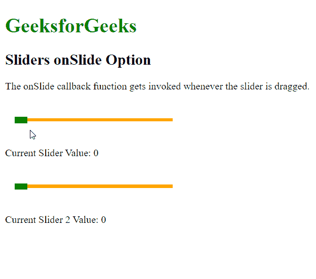

# 滑动选项上的脚本滑块

> 原文:[https://www . geesforgeks . org/script-aculo-us-slides-on slide-option/](https://www.geeksforgeeks.org/script-aculo-us-sliders-onslide-option/)

script.aculo.us 库是一个跨浏览器库，旨在改进网站的用户界面。滑块控件是允许用户输入值的细轨迹。这是通过定义一个值的范围来完成的，用户可以通过将手柄拖动到适当的值来选择该范围。

**onSlide** 选项用于指定一个回调函数，只要通过拖动移动滑块，该函数就会被调用。滑块的当前值将作为参数传递给函数。

**语法:**

```
{ onChange: function }
```

**参数:**该选项具有如上所述的单一值，如下所述:

*   **函数:**这是一个回调函数，每当拖动滑块时都会调用。

以下示例说明了该选项的使用。

**示例:**

## 超文本标记语言

```
<!DOCTYPE html>
<html>
<head>
  <!-- Include the required scripts -->
  <script type="text/javascript"
          src="prototype.js">
  </script>
  <script type="text/javascript" 
          src="scriptaculous.js?load = slider">
  </script>

  <!-- Style the Sliders so that they
  are properly visible -->
  <style type="text/css">
    .track {
      width: 250px;
      background-color: orange;
      height: 5px;
      position: relative;
    }

    .track .handle {
      width: 20px;
      height: 10px;
      background-color: green;
      cursor: move;
      position: absolute;
      top: -2px;
    }

    .pad {
      padding: 25px 15px;
    }
  </style>
</head>
<body>

<p>
  <h1 style="color: green;">
    GeeksforGeeks
  </h1>
  <h2>Sliders onSlide Option</h2>

<p>
    The onSlide callback function 
    gets invoked whenever the slider
    is dragged.
  </p>

  <div class="pad">
    <div id="track-hor" class="track">
      <div id="handle-hor" class="handle">
      </div>
    </div>
  </div>

<p>Current Slider Value: 
    <span id="out">0</span>
  </p>

  <div class="pad">
    <div id="track-hor2" class="track">
      <div id="handle-hor2" class="handle">
      </div>
    </div>
  </div>

<p>Current Slider 2 Value: 
    <span id="out2">0</span>
  </p>

  <script type="text/javascript">

    // Initialize the slider
    let slider = new Control.Slider('handle-hor',
      'track-hor', {

      // Define the range
      range: $R(1, 100),

      // Define the callback function to be
      // invoked when the slider is being
      // dragged
      onSlide: function (currValue) {
        document.querySelector("#out")
                  .textContent = currValue;
      }
    });

    // Initialize the slider
    let slider2 = new Control.Slider('handle-hor2',
      'track-hor2', {

      // Define the range
      range: $R(1, 100),
      values: [1, 5, 10, 50, 80, 100],

      // Define the callback function to be
      // invoked when the slider is being
      // dragged
      onSlide: function (currValue) {
        document.querySelector("#out2")
                  .textContent = currValue;
      }
    });
  </script>
</body>
</html>
```

**输出:**

