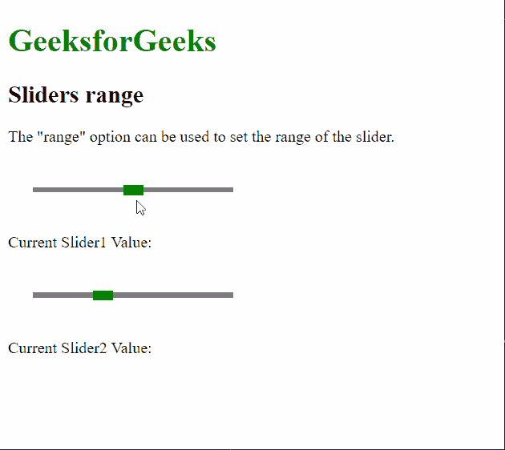

# 脚本 aculo.us 滑块范围选项

> 原文:[https://www . geesforgeks . org/script-aculo-us-sliders-range-option/](https://www.geeksforgeeks.org/script-aculo-us-sliders-range-option/)

script.aculo.us 库是一个跨浏览器库，旨在改进网站的用户界面。滑块控件是允许用户输入值的细轨迹。这是通过定义一个值的范围来完成的，用户可以通过将手柄拖动到适当的值来选择该范围。

**滑块范围**用于定义滑块的范围。滑块手柄只能在为两端定义的值内移动。必须使用$R(最小，最大)语法指定范围，其中**最小**表示滑块的最小值，**最大**表示最大值。

**语法:**

```
{ range: $R( min, max ) }
```

**值:**该选项有两个值，如上所述，描述如下:

*   **min:** 这是一个表示滑块范围最小值的数字。
*   **max:** 这是一个数字，表示滑块范围的最大值。

**示例:**

```
<!DOCTYPE html>
<html>
<head>
  <!-- Include the required scripts -->
  <script type="text/javascript" 
          src="prototype.js">
  </script>
  <script type="text/javascript"
          src="scriptaculous.js?load = slider">
  </script>

  <!-- Style the Sliders so that they
  are properly visible -->
  <style type="text/css">
    .track {
      width: 200px;
      background-color: gray;
      height: 5px;
      position: relative;
    }

    .track .handle {
      width: 20px;
      height: 10px;
      background-color: green;
      cursor: move;
      position: absolute;
      top: -2px;
    }

    .pad {
      padding: 25px;
    }
  </style>
</head>
<body>
  <p>
  <h1 style="color: green;">
    GeeksforGeeks
  </h1>
  <h2>Sliders range</h2>
  <p>
    The "range" option can be used to
    set the range of the slider.
  </p>

  <div class="pad">
    <div id="track-hor" class="track">
      <div id="handle-hor" class="handle">
      </div>
    </div>
  </div>
  <p>Current Slider1 Value: 
    <span id="out1"></span>
  </p>
  <div class="pad">
    <div id="track2-hor" class="track">
      <div id="handle2-hor" class="handle">
      </div>
    </div>
  </div>
  <p>Current Slider2 Value: 
    <span id="out2"></span>
  </p>
  <script type="text/javascript">
    new Control.Slider('handle-hor',
      'track-hor', {

      // Setting the range of the slider
      // from 0 to 100
      range: $R(0, 100),

      sliderValue: 50,

      onSlide: (val) => {
        document.querySelector("#out1")
                .textContent = val;
      }
    });

    new Control.Slider('handle2-hor',
      'track2-hor', {

      // Setting the range of the slider
      // from 20 to 50
      range: $R(20, 50),

      sliderValue: 30,

      onSlide: (val) => {
        document.querySelector("#out2")
                .textContent = val;
      }
    });
  </script>
</body>
</html>
```

**输出:**

