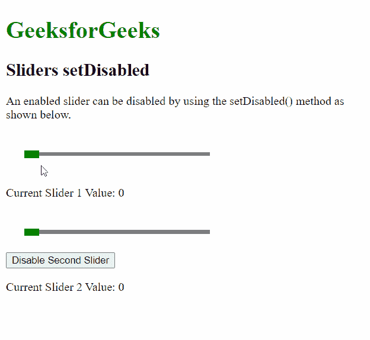

# 脚本 aculo.us 滑块设置禁用选项

> 原文:[https://www . geesforgeks . org/script-aculo-us-sliders-set disabled-option/](https://www.geeksforgeeks.org/script-aculo-us-sliders-setdisabled-option/)

script.aculo.us 库是一个跨浏览器库，旨在改进网站的用户界面。滑块控件是允许用户输入值的细轨迹。这是通过定义一个值的范围来完成的，用户可以通过将手柄拖动到适当的值来选择该范围。

**滑块设置禁用** 功能用于禁用给定的滑块。启用的滑块将其*禁用的*属性设置为假，用户可以与之交互。使用此功能将*禁用的*属性设置为真，并阻止用户与滑块交互。

**语法:**

```
setDisabled()

```

**参数:**此功能无参数。

**示例:**

## 超文本标记语言

```
<!DOCTYPE html>
<html>

<head>

    <!-- Include the required scripts -->
    <script type="text/javascript" 
        src="prototype.js">
    </script>

    <script type="text/javascript" 
        src="scriptaculous.js?load = slider">
    </script>

    <!-- Style the Sliders so that they
        are properly visible -->
    <style type="text/css">
        .track {
            width: 250px;
            background-color: gray;
            height: 5px;
            position: relative;
        }

        .track .handle {
            width: 20px;
            height: 10px;
            background-color: green;
            cursor: move;
            position: absolute;
            top: -2px;
        }

        .pad {
            padding: 25px;
        }
    </style>
</head>

<body>
    <h1 style="color: green;">
        GeeksforGeeks
    </h1>

    <h2>Sliders setDisabled</h2>

    <p>
        An enabled slider can be disabled 
        by using the setDisabled() method 
        as shown below.
    </p>

    <div class="pad">
        <div id="track-hor" class="track">
            <div id="handle-hor" class="handle">
            </div>
        </div>
    </div>

    <p>Current Slider 1 Value:
        <span id="out">0</span>
    </p>

    <div class="pad">
        <div id="track-hor2" class="track">
            <div id="handle-hor2" class="handle">
            </div>
        </div>
    </div>
    <button onclick="disableSlider()">
        Disable Second Slider
    </button>

    <p>Current Slider 2 Value:
        <span id="out2">0</span>
    </p>

    <script type="text/javascript">

        // Initialize the slider
        let slider = new Control.Slider('handle-hor',
            'track-hor', {

            // Define the range
            range: $R(1, 100),

            onSlide: (val) => {
                document.querySelector("#out")
                    .textContent = val;
            }
        });

        let slider2 = new Control.Slider('handle-hor2',
            'track-hor2', {

            // Define the range
            range: $R(1, 100),

            onSlide: (val) => {
                document.querySelector("#out2")
                    .textContent = val;
            }
        });

        function disableSlider() {

            // Set the value of the slider
            // to the given value
            slider2.setDisabled();
        }
    </script>
</body>

</html>
```

**输出:**

