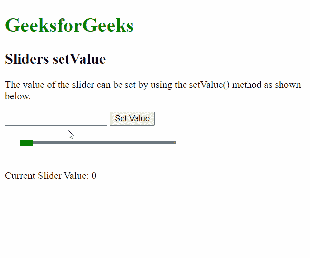

# script . aculo . us Sliders setValue 选项

> 原文:[https://www . geesforgeks . org/script-aculo-us-sliders-set value-option/](https://www.geeksforgeeks.org/script-aculo-us-sliders-setvalue-option/)

script.aculo.us 库是一个跨浏览器库，旨在改进网站的用户界面。滑块控件是允许用户输入值的细轨迹。这是通过定义一个值的范围来完成的，用户可以通过将手柄拖动到适当的值来选择该范围。

**滑块设置值**功能用于将滑块的值更新为给定值。它会将滑块的手柄移动到滑块轨道的适当位置。每当使用此方法时，都会调用 onChange()回调函数，该函数可用于跟踪值的变化。

**语法:**

```
setValue( value, handleIndex )
```

**参数:**该功能有两个参数，如上所述，描述如下:

*   **值:**这是一个将用于更新滑块值的数字。
*   **handleIndex:** 用于定义使用多个滑块时要更新的滑块的索引。这是一个可选参数。如果不传递该值，则更新最后使用的滑块。

**示例:**

```
<!DOCTYPE html>
<html>
<head>
  <!-- Include the required scripts -->
  <script type="text/javascript"
          src="prototype.js">
  </script>
  <script type="text/javascript" 
          src="scriptaculous.js?load = slider">
  </script>

  <!-- Style the Sliders so that they
  are properly visible -->
  <style type="text/css">
    .track {
      width: 250px;
      background-color: gray;
      height: 5px;
      position: relative;
    }

    .track .handle {
      width: 20px;
      height: 10px;
      background-color: green;
      cursor: move;
      position: absolute;
      top: -2px;
    }

    .pad {
      padding: 25px;
    }
  </style>
</head>
<body>
  <p>
  <h1 style="color: green;">
    GeeksforGeeks
  </h1>
  <h2>Sliders setValue</h2>
  <p>
    The value of the slider can be set
    by using the setValue() method 
    as shown below.
  </p>

  <input type="text" id="val">
  <button onclick="setVal()">
    Set Value
  </button>

  <div class="pad">
    <div id="track-hor" class="track">
      <div id="handle-hor" class="handle">
      </div>
    </div>
  </div>
  <p>Current Slider Value: 
    <span id="out">0</span>
  </p>

  <script type="text/javascript">

    // Initialize the slider
    let slider = new Control.Slider(
      'handle-hor',
      'track-hor', {

      // Define the range
      range: $R(1, 100),

      onChange: function (v) {
        document.querySelector("#out")
                .textContent = v;
      }
    });

    function setVal() {

      // Get the value form the input box
      let val = 
          document.querySelector("#val").value;

      // Set the value of the slider
      // to the given value
      slider.setValue(val);
    }
  </script>
</body>
</html>
```

**输出:**

