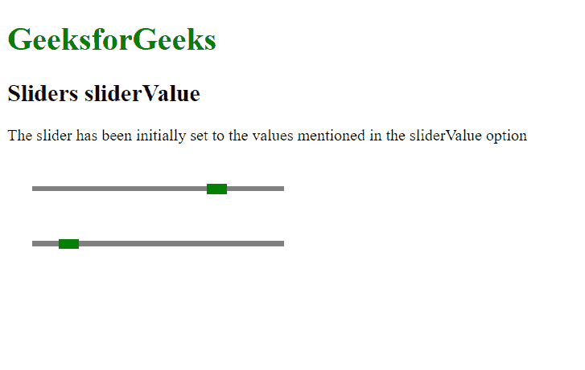

# script.aculo.us 滑块滑块值选项

> 原文:[https://www . geeksforgeeks . org/script-aculo-us-sliders-slidervalue-option/](https://www.geeksforgeeks.org/script-aculo-us-sliders-slidervalue-option/)

script.aculo.us 库是一个跨浏览器库，旨在改善网站的用户界面。滑块控件是允许用户输入值的细轨迹。这是通过定义一个值的范围来完成的，用户可以通过将手柄拖动到适当的值来选择该范围。

**滑块滑动值** 选项用于定义设置滑块手柄的初始值。只有当给定值在滑块允许表示的值范围内时，才会遵循此规则。

**语法:**

```
{ sliderValue: value }

```

**值:**

*   **值:**这是一个将作为滑块初始值的数字。默认值为 0。

**例**

## 超文本标记语言

```
<!DOCTYPE html>
<html>

<head>
    <!-- Include the required scripts -->
    <script type="text/javascript" 
        src="prototype.js">
    </script>

    <script type="text/javascript" 
        src="scriptaculous.js?load = slider">
    </script>

    <!-- Style the Sliders so that they
        are properly visible -->
    <style type="text/css">
        .track {
            width: 250px;
            background-color: gray;
            height: 5px;
            position: relative;
        }

        .track .handle {
            width: 20px;
            height: 10px;
            background-color: green;
            cursor: move;
            position: absolute;
            top: -2px;
        }

        .pad {
            padding: 25px;
        }
    </style>
</head>

<body>
    <h1 style="color: green;">
        GeeksforGeeks
    </h1>

    <h2>Sliders sliderValue</h2>

    <p>
        The slider has been initially set
        to the values mentioned in the
        sliderValue option
    </p>

    <div class="pad">
        <div id="track-hor" class="track">
            <div id="handle-hor" class="handle">
            </div>
        </div>
    </div>

    <div class="pad">
        <div id="track2-hor" class="track">
            <div id="handle2-hor" class="handle">
            </div>
        </div>
    </div>

    <script type="text/javascript">
        new Control.Slider('handle-hor',
            'track-hor', {
            range: $R(1, 10),

            // Set the initial value
            // of the slider
            sliderValue: 7.75,
        });

        new Control.Slider('handle2-hor',
            'track2-hor', {
            range: $R(1, 10),

            // Set the initial value
            // of the slider
            sliderValue: 2,
        });
    </script>
</body>

</html>
```

**输出:**

