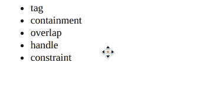
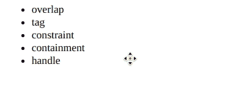

# 脚本 aculo.us 排序约束选项

> 原文:[https://www . geesforgeks . org/script-aculo-us-sorting-constraint-option/](https://www.geeksforgeeks.org/script-aculo-us-sorting-constraint-option/)

可排序模块中的约束选项用于在拖动元素时限制元素的移动方向。它可以设置为“水平”或“垂直”，从而只允许在该方向上移动。它的默认值是“垂直”。

**语法:**

```
Sortable.create('list', {constraint: 'horizonatal' | 'vertical' })
```

以下示例演示了该选项:

**示例 1:** 在本例中，约束选项设置为“水平”。

## 超文本标记语言

```
<!DOCTYPE html>
<html>

<head>
    <script type="text/javascript" 
        src="prototype.js">
    </script>

    <script type="text/javascript" 
        src="scriptaculous.js">
    </script>

    <style>
        li {
            cursor: move;
        }
    </style>
</head>

<body>
    <ul id="list">
        <li>tag</li>
        <li>overlap</li>
        <li>constraint</li>
        <li>containment</li>
        <li>handle</li>
    </ul>

    <script>
        Sortable.create('list', {
            tag: 'li',
            constraint: 'horizontal'
        });
    </script>
</body>

</html>
```

**输出:**



**示例 2:** 在此示例中，约束选项设置为“垂直”。

## 超文本标记语言

```
<!DOCTYPE html>
<html>

<head>
    <script type="text/javascript" 
        src="prototype.js">
    </script>

    <script type="text/javascript" 
        src="scriptaculous.js">
    </script>

    <style>
        li {
            cursor: move;
        }
    </style>
</head>

<body>
    <ul id="list">
        <li>tag</li>
        <li>overlap</li>
        <li>constraint</li>
        <li>containment</li>
        <li>handle</li>
    </ul>

    <script>
        Sortable.create('list', {
            tag: 'li',
            constraint: 'vertical'
        });
    </script>
</body>

</html>
```

**输出:**

