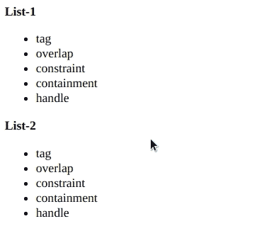
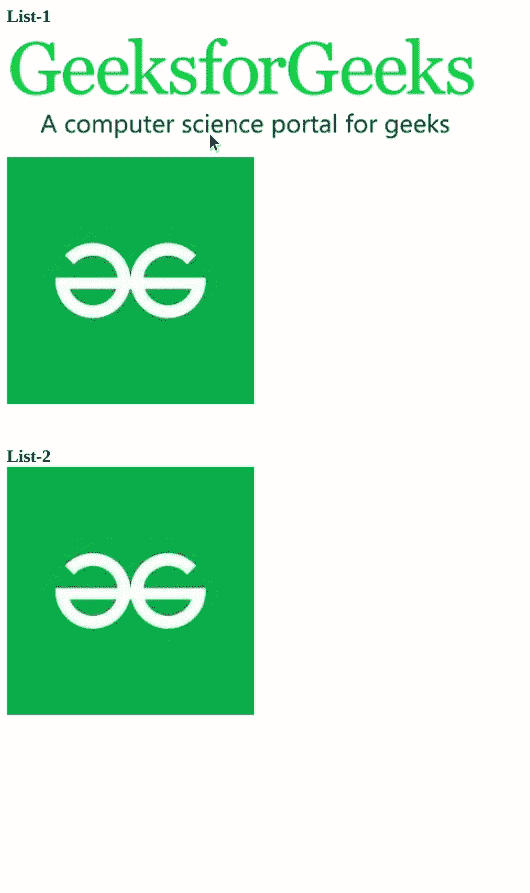

# 脚本. aculo.us 分类遏制选项

> 原文:[https://www . geesforgeks . org/script-aculo-us-sorting-containment-option/](https://www.geeksforgeeks.org/script-aculo-us-sorting-containment-option/)

排序元素模块中的包含选项用于在两个可排序元素之间进行排序。它接受要启用排序的元素或元素 id 的数组。

**语法:**

> Sortable.create("element1_id "，{containment: ["element1_id "，" element 2 _ id "]})；
> sortable . create(“element 2 _ id”，{ containment:[“element 1 _ id”，“element 2 _ id”]})；

以下示例演示了该选项:

**例 1:**

## 超文本标记语言

```
<!DOCTYPE html>
<html>

<head>
    <script type="text/javascript" 
        src="./prototype.js">
    </script>

    <script type="text/javascript" 
        src="./scriptaculous.js">
    </script>

    <script>
        window.onload = function () {
            Sortable.create("list1", {
                tag: "li",
                containment: ["list1", "list2"],
            });
            Sortable.create("list2", {
                tag: "li",
                containment: ["list1", "list2"],
            });
        };
    </script>

    <style>
        li {
            cursor: move;
        }
    </style>
</head>

<body>
    <strong>List-1</strong>
    <ul id="list1">
        <li>tag</li>
        <li>overlap</li>
        <li>constraint</li>
        <li>containment</li>
        <li>handle</li>
    </ul>

    <strong>List-2</strong>
    <ul id="list2">
        <li>tag</li>
        <li>overlap</li>
        <li>constraint</li>
        <li>containment</li>
        <li>handle</li>
    </ul>
</body>

</html>
```

**输出:**



**例 2:**

## 超文本标记语言

```
<!DOCTYPE html>
<html>

<head>
    <script type="text/javascript" 
        src="./prototype.js">
    </script>

    <script type="text/javascript" 
        src="./scriptaculous.js">
    </script>

    <script>
        window.onload = function () {
            Sortable.create("list1", {
                tag: "div",
                containment: ["list1", "list2"],
            });
            Sortable.create("list2", {
                tag: "div",
                containment: ["list1", "list2"],
            });
        };
    </script>
</head>

<body>
    <strong>List-1</strong>
    <div id="list1">
      <div></div>
      <div></div>
    </div>
    <br /><br />

    <strong>List-2</strong>
    <div id="list2">
      <div></div>
    </div>
</body>

</html>
```

**输出:**

