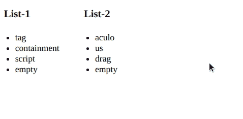

# 脚本. aculo.us 排序 dropOnEmpty 选项

> 原文:[https://www . geesforgeks . org/script-aculo-us-sorting-droponempty-option/](https://www.geeksforgeeks.org/script-aculo-us-sorting-droponempty-option/)

可排序模块中的 dropOnEmpy 选项允许将可排序的元素放到另一个列表中。它的默认值是 false。

**语法:**

> Sortable.create(List1_id，{containment: [List1_id，List2_id]，DropOnEmpty:true })；
> Sortable.create(List2_id，{containment: [List1_id，List2_id]，DropOnEmpty:true })；

**示例:**

```
<!DOCTYPE html>
<html>

<head>
    <script type="text/javascript" 
        src="./javascript/prototype.js">
    </script>

    <script type="text/javascript" 
        src="./javascript/scriptaculous.js">
    </script>

    <script>
        window.onload = function () {

            Sortable.create('List1', {
                containment: ['List1', 'List2'],
                dropOnEmpty: true
            });

            Sortable.create('List2', {
                containment: ['List1', 'List2'],
                dropOnEmpty: true
            });
        }
    </script>

    <style type="text/css">
        li {
            cursor: move;
        }

        ul {
            width: 80px;
            padding: 5px 5px 5px 20px;
        }
    </style>
</head>

<body>
    <div style="float:left">
        <h3>List-1</h3>
        <ul id="List1">
            <li>tag</li>
            <li>containment</li>
            <li>script</li>
            <li>empty</li>
        </ul>
    </div>

    <div style="float:left;margin-left:30px">
        <h3>List-2</h3>
        <ul id="List2">
            <li>aculo</li>
            <li>us</li>
            <li>drag</li>
            <li>empty</li>
        </ul>
    </div>
</body>

</html>
```

**输出:**
