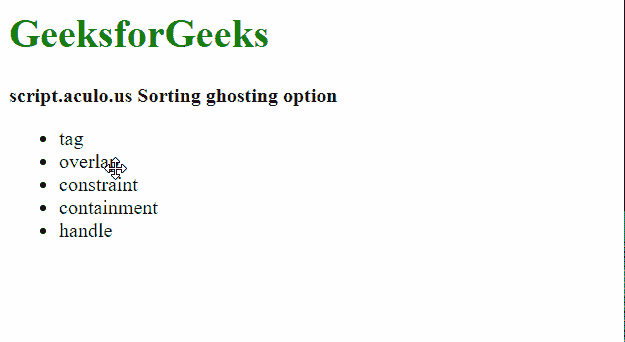
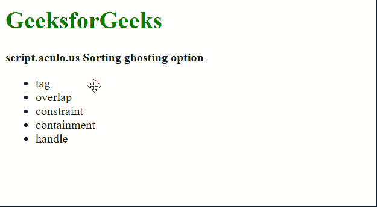

# 脚本. aculo.us 排序重影选项

> 原文:[https://www . geesforgeks . org/script-aculo-us-sorting-ghosting-option/](https://www.geeksforgeeks.org/script-aculo-us-sorting-ghosting-option/)

可排序模块中的*重影*选项用于使用户能够制作随鼠标指针移动的元素的半透明副本。它的默认值是“假”，这意味着不复制。

**语法:**

```html
Sortable.create('list', {ghosting: boolean})
```

以下示例演示了该选项:

**示例 1:** 在本例中，重影选项设置为“假”。

## 超文本标记语言

```html
<!DOCTYPE html>
<html>

<head>
    <script type="text/javascript" 
        src="prototype.js">
    </script>

    <script type="text/javascript" 
        src="scriptaculous.js">
    </script>

    <style>
        li {
            cursor: move;
        }
    </style>
</head>

<body>
    <h1 style="color: green;">
        GeeksforGeeks
    </h1>

    <b>
        script.aculo.us Sorting
        ghosting option
    </b>

    <ul id="list">
        <li>tag</li>
        <li>overlap</li>
        <li>constraint</li>
        <li>containment</li>
        <li>handle</li>
    </ul>

    <script>
        Sortable.create('list',
            {
                tag: 'li',

                // Setting the ghosting
                // parameter to false
                ghosting: false
            }
        );
    </script>
</body>

</html>
```

**输出:**



**示例 2:** 在本例中，重影选项设置为“真”。

## 超文本标记语言

```html
<!DOCTYPE html>
<html>

<head>
    <script type="text/javascript"
        src="prototype.js">
    </script>

    <script type="text/javascript" 
        src="scriptaculous.js">
    </script>

    <style>
        li {
            cursor: move;
        }
    </style>
</head>

<body>
    <h1 style="color: green;">
        GeeksforGeeks
    </h1>

    <b>
        script.aculo.us Sorting
        ghosting option
    </b>

    <ul id="list">
        <li>tag</li>
        <li>overlap</li>
        <li>constraint</li>
        <li>containment</li>
        <li>handle</li>
    </ul>

    <script>
        Sortable.create('list',
            {
                tag: 'li',

                // Setting the ghosting
                // parameter to true
                ghosting: true
            }
        );
    </script>
</body>

</html>
```

**输出:**

