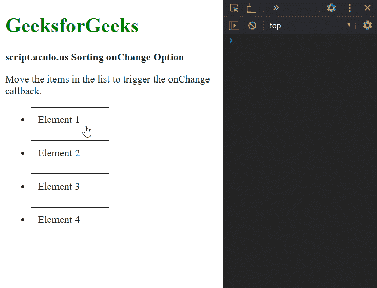

# 脚本. aculo.us 排序更改选项

> 原文:[https://www . geesforgeks . org/script-aculo-us-sorting-onchange-option/](https://www.geeksforgeeks.org/script-aculo-us-sorting-onchange-option/)

script.aculo.us 库是一个跨浏览器库，旨在改进网站的用户界面。可排序模块可用于使任何列表可排序，允许用户根据所需的顺序拖动任何项目。

**onChange** 选项用于指定一个回调函数，只要在列表中拖动项目期间排序顺序发生变化，该函数就会被调用。顺序被更改的元素将作为参数传递给函数。

**语法:**

```
{ onChange: function }
```

**参数:**该选项具有如上所述的单一值，如下所述:

*   **函数:**这是一个回调函数，每当元素的顺序改变时都会调用。

以下示例说明了该选项的使用。

**示例:**

## 超文本标记语言

```
<!DOCTYPE html>
<html>

<head>
  <script type="text/javascript" 
          src="prototype.js">
  </script>

  <script type="text/javascript" 
          src="scriptaculous.js">
  </script>

  <style>
    li {
      cursor: pointer;
      height: 30px;
      width: 100px;
      border: 1px solid;
      padding: 10px;
    }
  </style>
</head>

<body>
  <div>
    <h1 style="color: green">
      GeeksforGeeks
    </h1>
  </div>

  <strong>
    script.aculo.us Sorting onChange Option
  </strong>

  <p>
    Move the items in the list to 
    trigger the onChange callback.
  </p>

  <ul id="list1">
    <li>Element 1</li>
    <li>Element 2</li>
    <li>Element 3</li>
    <li>Element 4</li>
  </ul>

  <script type="text/javascript">
    window.onload = function () {

      Sortable.create("list1", {

        // Define the function to be used
        // when the list order changes
        onChange: (elem) => {
          console.log(
            "The element that was changed was:",
            elem.textContent);
        }
      });
    };
  </script>
</body>

</html>
```

**输出:**

