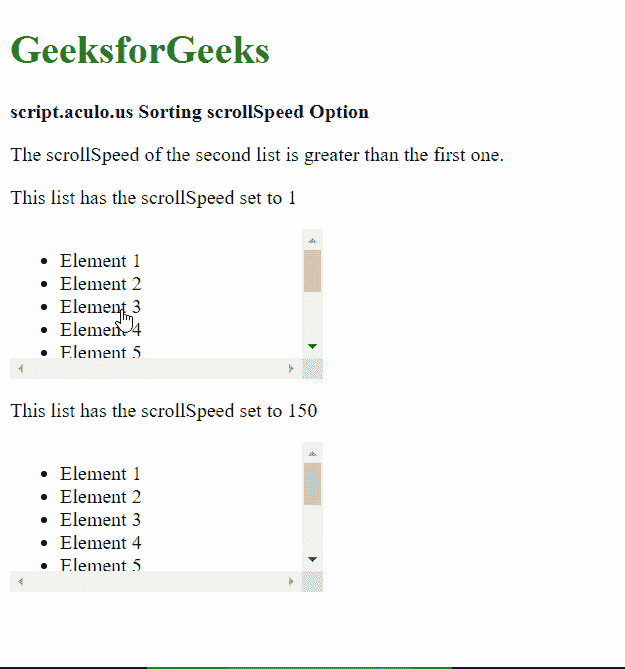

# 脚本. aculo.us 排序滚动速度选项

> 原文:[https://www . geeksforgeeks . org/script-aculo-us-sorting-scroll speed-option/](https://www.geeksforgeeks.org/script-aculo-us-sorting-scrollspeed-option/)

script.aculo.us 库是一个跨浏览器库，旨在改进网站的用户界面。可排序模块可用于使任何列表可排序，允许用户根据所需的顺序拖动任何项目。

**滚动速度**选项用于指定当项目移出滚动容器时，容器滚动的增量。它以像素为单位。更高的值意味着容器滚动得更快。

**语法:**

```
{ scrollSpeed: value }
```

**参数:**该选项具有如上所述的单一值，如下所述:

*   **值:**这是一个整数值，指定滚动容器滚动的增量，默认为 15。

以下示例说明了该选项的使用。

**示例:**

## 超文本标记语言

```
<!DOCTYPE html>
<html>

<head>
  <script type="text/javascript"
          src="prototype.js">
  </script>

  <script type="text/javascript" 
          src="scriptaculous.js">
  </script>

  <style>
    #scrollable1,
    #scrollable2 {
      overflow-x: scroll;
      height: 120px;
      width: 250px;
    }

    li {
      cursor: pointer;
    }
  </style>
</head>

<body>
  <div>
    <h1 style="color: green">
      GeeksforGeeks
    </h1>
  </div>

  <strong>
    script.aculo.us Sorting scrollSpeed Option
  </strong>

  <p>
    The scrollSpeed of the second list
    is greater than the first one.
  </p>

  <p>
    This list has the scrollSpeed
    set to 1
  </p>

  <div id="scrollable1">
    <ul id="list1">
      <li>Element 1</li>
      <li>Element 2</li>
      <li>Element 3</li>
      <li>Element 4</li>
      <li>Element 5</li>
      <li>Element 6</li>
      <li>Element 7</li>
      <li>Element 8</li>
      <li>Element 9</li>
      <li>Element 10</li>
    </ul>
  </div>

  <p>
    This list has the 
    scrollSpeed set to 150
  </p>

  <div id="scrollable2">
    <ul id="list2">
      <li>Element 1</li>
      <li>Element 2</li>
      <li>Element 3</li>
      <li>Element 4</li>
      <li>Element 5</li>
      <li>Element 6</li>
      <li>Element 7</li>
      <li>Element 8</li>
      <li>Element 9</li>
      <li>Element 10</li>
    </ul>
  </div>

  <script type="text/javascript">
    window.onload = function () {

      Sortable.create("list1", {

          // Define the container to scroll
          scroll: 'scrollable1',

          // Set the scroll speed
          scrollSpeed: 1
      });

      Sortable.create("list2", {

          // Define the container to scroll
          scroll: 'scrollable2',

          // Set the scroll speed
          scrollSpeed: 150
        });
    };
  </script>
</body>

</html>
```

**输出:**

