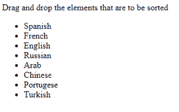
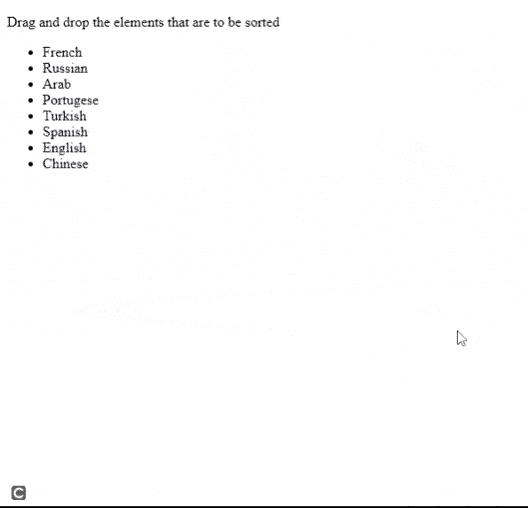
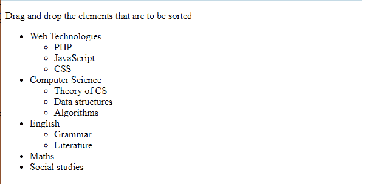
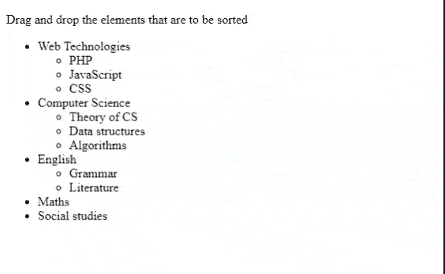

# 脚本. aculo.us 排序树选项

> 原文:[https://www . geesforgeks . org/script-aculo-us-sorting-tree-option/](https://www.geeksforgeeks.org/script-aculo-us-sorting-tree-option/)

用户应该能够通过拖放对元素(如列表中的项目)进行重新排序。没有拖放，重新排序不是一个普通的任务，但是 [**script.aculo.us**](https://www.geeksforgeeks.org/script-aculo-us-introduction/) 通过 *Sortable* 类提供了开箱即用的扩展重新排序支持。

当*树*选项设置为“*真”*时，它允许使用可排序元素内的子元素进行排序。默认值为“*假*”。使其可排序的元素被传递给**可排序的**命名空间中的 **create()** 方法。

一个**可排序的**由容器元素中的项目元素组成。当你创建一个新的*可排序*时，它会负责创建相应的可拖动对象和可拖放对象。

要使用 **script.aculo.us** *可排序*功能，您需要加载拖放模块，这也需要效果模块。代码实现所需的预编译文件如下。

> <脚本类型=“text/JavaScript”src =“script aculous-js-1 . 9 . 0/src/script aculous . js？负载=效果，拖拽">

**语法:****create()**方法用于创建可排序的项目。 **create()** 方法获取容器元素的 id，并根据传递的选项对它们进行排序。

```
Sortable.create('id-of-container', [options]);
```

**Sortable.destroy()** 方法用于移除所有由 **Sortable.create()** 方法创建的事件处理程序和引用。

如果引用的元素已经是可排序的，则调用**可排序的创建，**隐式调用**可排序的销毁**。

**语法:**

```
Sortable.destroy( element );
```

**示例 1:** 下面演示了列表的拖放功能。下一个示例将演示在一个简单的列表元素上开发的树的拖放。

## 超文本标记语言

```
<!DOCTYPE html>
<html>

<head>
    <script type="text/javascript" src="prototype.js">
    </script>

    <script type="text/javascript" src=
        "scriptaculous.js?load = effects,dragdrop">
    </script>

    <script type="text/javascript ">
        window.onload = function() {
            Sortable.create('namelist', {
                tag: 'li'
            });
        }
    </script>

    <style type="text/css ">
        li {
            cursor: move;
        }
    </style>
</head>

<body>
    <p>
        Drag and drop the elements 
        that are to be sorted
    </p>

    <ul id="namelist ">
        <li>Spanish</li>
        <li>French</li>
        <li>English</li>
        <li>Russian</li>
        <li>Arab</li>
        <li>Chinese</li>
        <li>Portugese</li>
        <li>Turkish</li>
    </ul>
</body>

</html>
```

**输出:**

**执行前:**



**执行后:**



**示例 2:** 以下示例演示了从列表元素中创建的树结构的拖放。

## 超文本标记语言

```
<!DOCTYPE html>
<html>

<head>
    <script type="text/javascript" 
        src="prototype.js">
    </script>

    <script type="text/javascript" src=
        "scriptaculous.js?load = effects,dragdrop" ">
    </script>

    <script type="text/javascript ">
        window.onload = function() {
           Sortable.create('namelist', {
                tree: true,
                scroll: window,
                treeTag: 'ul',
                tag: 'li'
            });
        }
    </script>

    <style type = "text/css ">
        li { cursor: move; }
    </style>
</head>

<body>
    <p>
        Drag and drop the elements 
        that are to be sorted
    </p>

    <ul id="namelist ">
        <li>Web Technologies
            <ul>
                <li>PHP</li>
                <li>CSS</li>
                <li>JavaScript</li>
            </ul>
        </li>

        <li>Computer Science
            <ul>
                <li>Data structures</li>
                <li>Theory of CS</li>
                <li>Algorithms</li>
            </ul>
        </li>

        <li>English
            <ul>
                <li>Grammar</li>
                <li>Literature</li>
            </ul>
        </li>

        <li>Maths</li>
        <li>Social studies</li>
    </ul>
</body>

</html>
```

**输出:**

**执行前:**



**执行后:**

