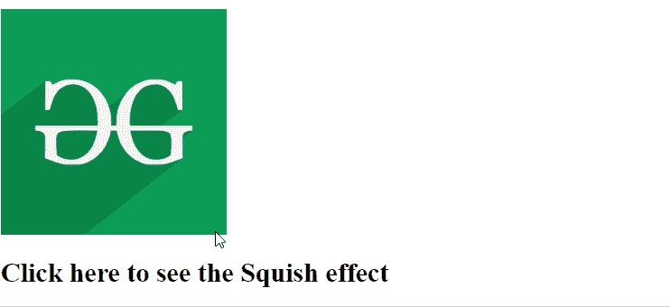
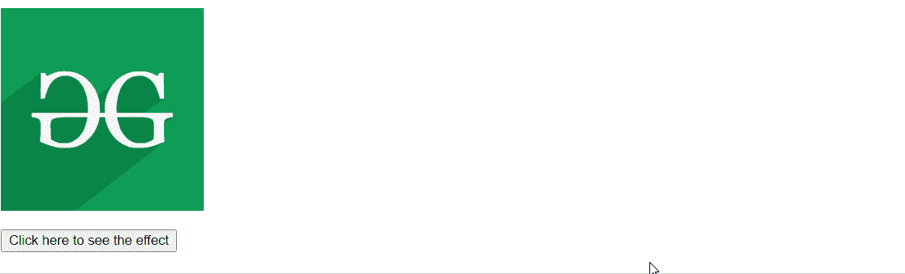

# script.aculo.us Squish 效果

> 原文:[https://www . geesforgeks . org/script-aculo-us-squish-effect/](https://www.geeksforgeeks.org/script-aculo-us-squish-effect/)

在本文中，我们将通过使用一个名为 **script.aculo.us** 的 JavaScript 库来演示 **Squish** 效果，该库在保持左上角不动的情况下平滑地缩小了大小。我们也可以调整效果的持续时间。

**语法:**

```
Effect.Squish('id_of_element');

// Or

Effect.Squish('id_of_element', { duration: dur });
```

**参数:**

*   **id_of_element:** 它保存要应用效果的元素。
*   **持续时间:**保存该效果所占用的持续时间。

**注意:**要使用这个库，我们应该下载或安装这个库，然后在我们的程序中使用它。而要做到这一点，你可以顺着这个链接[http://script.aculo.us/downloads](http://script.aculo.us/downloads)。

**进场:**

*   为了演示这个函数的用法，我们编写了一小段代码。其中我们编写了一个名为**squisheeffect(**)方法的小 JavaScript 函数，使用了这个库的 **Squish()** 方法。
*   通过点击点击图像挤压，你会清楚地看到效果。

**示例 1:** 要查看效果，首先安装库，然后在本地环境中打开以下程序。

## 超文本标记语言

```
<!DOCTYPE html>
<html>

<head>
    <script type="text/javascript" 
        src="prototype.js">
    </script>

    <script type="text/javascript" 
        src="scriptaculous.js?load = effects">
    </script>

    <script type="text/javascript">
        function GFGSquish(el) {
            new Effect.Squish(el, { duration: 4 });
        }
    </script>
</head>

<body>
    <div id="myimage" onclick="GFGSquish(this);">

        

        <h2>Click here to see the Squish effect </h2>
    </div>
</body>

</html>
```

**输出:**



**示例 2:** 在这个示例中，我们更改了效果的持续时间，还添加了一个按钮来查看效果。

## 超文本标记语言

```
<!DOCTYPE html>
<html>

<head>
    <script type="text/javascript" 
        src="prototype.js">
    </script>

    <script type="text/javascript" 
        src="scriptaculous.js?load = effects">
    </script>

    <script type="text/javascript">
        function GFGSquish(el) {
            new Effect.Squish(el, { duration: 3 });
        }
    </script>
</head>

<body>
    <div id="myimage">
        

        <br><br>
        <button onclick="GFGSquish('myimage');">
            Click here to see the effect
        </button>
    </div>
</body>

</html>
```

**输出:**

