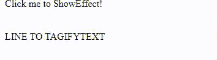

# script.aculo.us tagifyText 效果

> 原文:[https://www . geesforgeks . org/script-aculo-us-tagifytext-effect/](https://www.geeksforgeeks.org/script-aculo-us-tagifytext-effect/)

在本文中，我们将通过使用名为 **script.aculo.us** 的 javascript 库来演示 **tagifyText** 的效果，该库具有从一个到另一个的平滑过渡。我们也可以调整效果的持续时间。

**语法:**

```
Effect.tagifyText(element);
```

**注意:**要使用这个库，我们应该安装这个库，然后在我们的程序中使用它。而要做到这一点你可以遵循这个链接[http://script.aculo.us/downloads](http://script.aculo.us/downloads)。

**演示:**

为了演示这个函数的用法，我们编写了一小段代码。其中我们编写了一个名为 ShowEffect 方法的小 javascript 函数，使用了这个库的 **tagifyText** 方法。点击**点击我标记下一行！**，你会看清楚效果。

若要查看效果，请先安装库，然后在本地环境中打开此程序。

```
<!DOCTYPE html>
<html>
    <head>
        <title>script.aculo.us examples</title>

        <script type = "text/javascript" 
                src = "prototype.js"></script>
        <script type = "text/javascript" 
                src = "scriptaculous.js" ></script>

        <script type = "text/javascript">
            function ShowEffect(element){
                new Effect.tagifyText(element);
            }
        </script>
    </head>

    <body>
        <div onclick = "ShowEffect('geeks_1')">
            Click me to ShowEffect!
        </div>
        <br />
        <br />

        <div id = "geeks_1">
            LINE TO TAGIFYTEXT
        </div>
    </body>
</html>
```

**输出:**

