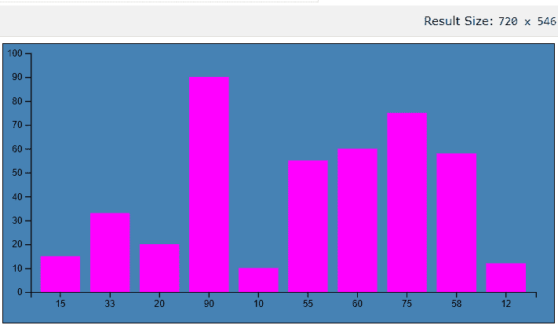
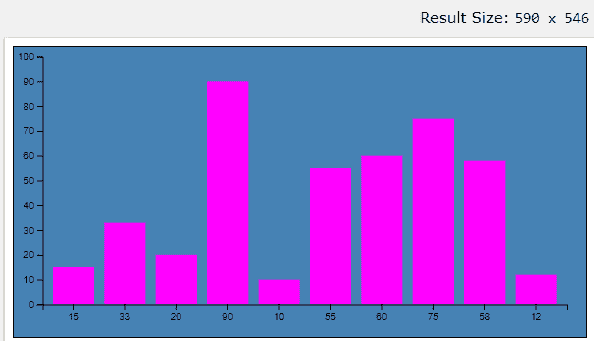
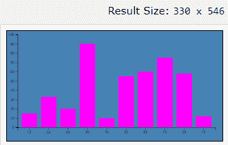

# 响应 d3.js 可视化布局的最佳方式

> 原文:[https://www . geesforgeks . org/best-to-make-a-D3-js-visualization-layout-responsive/](https://www.geeksforgeeks.org/best-way-to-make-a-d3-js-visualization-layout-responsive/)

D3 代表数据驱动文档。这是一个开源的 JavaScript 库，用于在浏览器中使用 HTML、SVG 和 CSS 创建交互式数据可视化。当今世界正在产生大量的数据，这些数据很难存储和分析。数据的可视化表示是传达存储信息的最有效方式，D3 提供了创建这些数据可视化的便利性和灵活性。

使任何 SVG 或 D3.js 图表响应的简单方法。这里我们将使用 D3.js 来使条形图具有响应性。
**创建 d3.js 可视化响应的方法:**让我们看看我们已经学习的一些重要概念，这些概念将通过下面的 HTML 代码实现。

*   选择要执行操作的元素。

```
d3.select("body");
```

*   使用。append()方法添加元素。

```
var svg = d3.select("body").append("svg");
```

*   set.attr()用于设置属性(高度/宽度)

```
svg.attr({"width":500, "height":500}); 
```

*   最后一步是将数据追加到 DOM 中。

```
var data_values = [15, 33, 20, 90, 10, 55, 60, 75, 58, 12];

// Create rectangles 
var bars = svg.selectAll("rect")
.data(data_values)
.enter()
.append("rect")
.attr("width", "25px")
.attr("height", function(d){ return d; });
```

*   现在，要使图表具有响应性，请用使用相同高度和宽度值的 viewBox 属性替换图表的设置高度和宽度。

```
.attr("viewBox", `0 0 300 600`)
```

*   图表的大小由高度 300 和宽度 600 预先定义。

```
const svg = d3
.select("#chart")
.append("svg")
.attr("height", 300)
.attr("width", 600);
```

**示例:**

## 超文本标记语言

```
<!DOCTYPE html>
<html>

<head>
    <title>
        What is the best way to make a d3.js
        visualization layout responsive?
    </title>

    <style>
        #chart {
            background: steelblue;
            border: 1px solid black;
        }

        rect {
            fill: magenta;
        }
    </style>

</head>

<body>
    <div id="chart"></div>
    <script src='https://d3js.org/d3.v5.min.js'></script>   
    <script id="rendered-js">
        const margin = {
            top: 10,
            right: 20,
            bottom: 30,
            left: 30
        };

        // Dimensions: 400 x 400
        // used for the initial rendering
        // width to height proportion
        // its preserved as the chart is resized
        const width = 600 - margin.left - margin.right;
        const height = 300 - margin.top - margin.bottom;
        const data = [15, 33, 20, 90, 10, 55, 60, 75, 58, 12];

        const xScale = d3.scaleBand().
        padding(0.2).
        domain(data).
        range([0, width]);

        const yScale = d3.scaleLinear().
        domain([0, 100]).
        range([height, 0]);

        const svg = d3.select('#chart').
        append('svg').
        attr('width', width + margin.left + margin.right).
        attr('height', height + margin.top + margin.bottom).
        call(responsivefy) // Call responsivefy to make the chart responsive
            .append('g').
        attr('transform', `translate(${margin.left}, ${margin.top})`);

        svg.selectAll('rect').
        data(data).
        enter().
        append('rect').
        attr('x', d => xScale(d)).
        attr('y', d => yScale(d)).
        attr('width', d => xScale.bandwidth()).
        attr('height', d => height - yScale(d));

        svg.append('g').call(d3.axisLeft(yScale));

        svg.append('g').
        attr('transform', `translate(0, ${height})`).
        call(d3.axisBottom(xScale));

        function responsivefy(svg) {

            // Container is the DOM element, svg is appended.
            // Then we measure the container and find its
            // aspect ratio.
            const container = d3.select(svg.node().parentNode),
                width = parseInt(svg.style('width'), 10),
                height = parseInt(svg.style('height'), 10),
                aspect = width / height;

            // Add viewBox attribute to set the value to initial size
            // add preserveAspectRatio attribute to specify how to scale
            // and call resize so that svg resizes on page load
            svg.attr('viewBox', `0 0 ${width} ${height}`).
            attr('preserveAspectRatio', 'xMinYMid').
            call(resize);

            d3.select(window).on('resize.' + container.attr('id'), resize);

            function resize() {
                const targetWidth = parseInt(container.style('width'));
                svg.attr('width', targetWidth);
                svg.attr('height', Math.round(targetWidth / aspect));
            }
        }
    </script>
</body>

</html>
```

**输出:**当窗口大小改变时，创建的图形会调整大小，而不是切割图形的边缘:

*   屏幕尺寸 720*546



*   屏幕尺寸 590*546



*   屏幕尺寸 330*546

